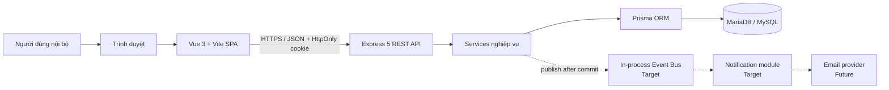
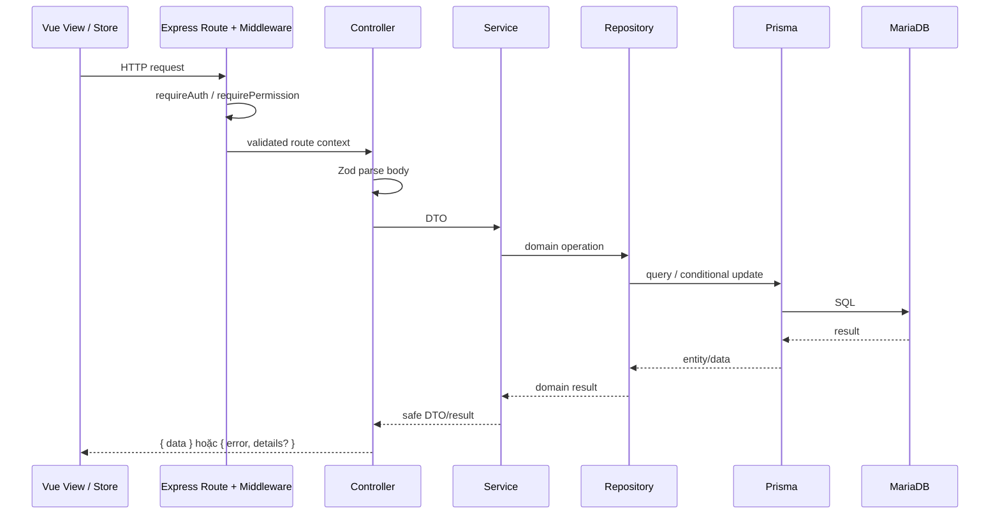
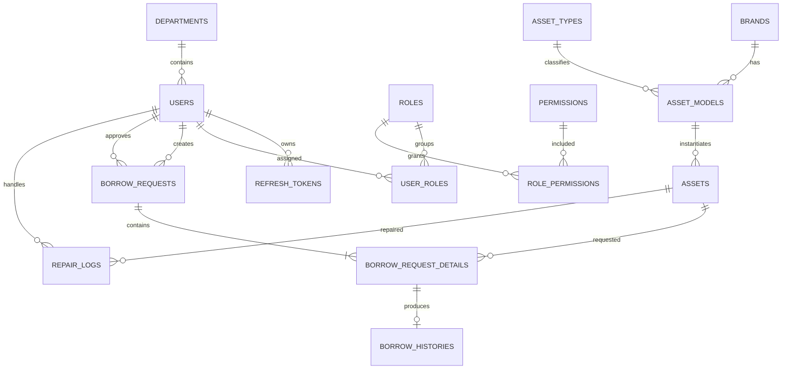
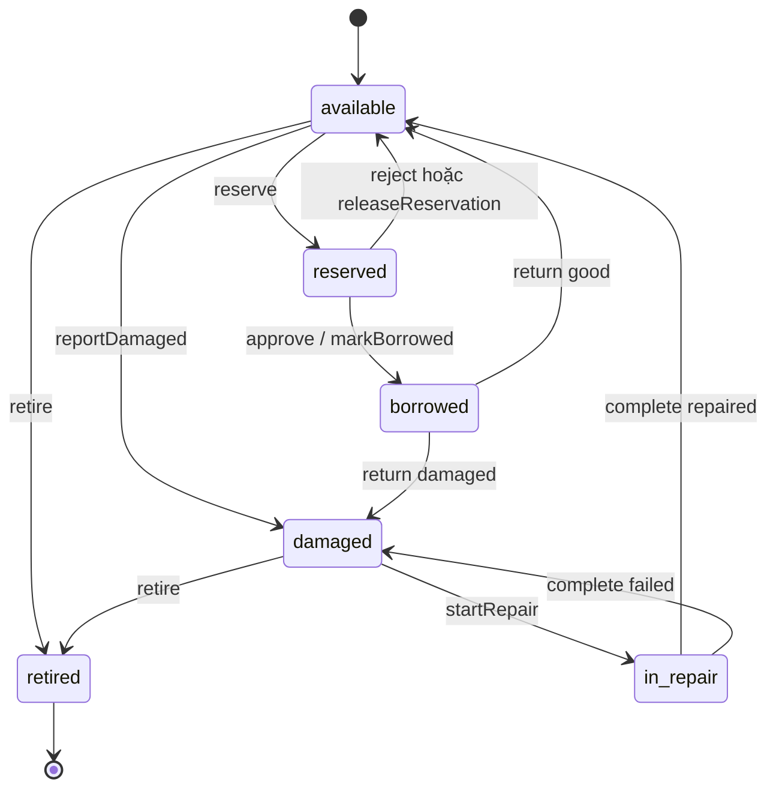
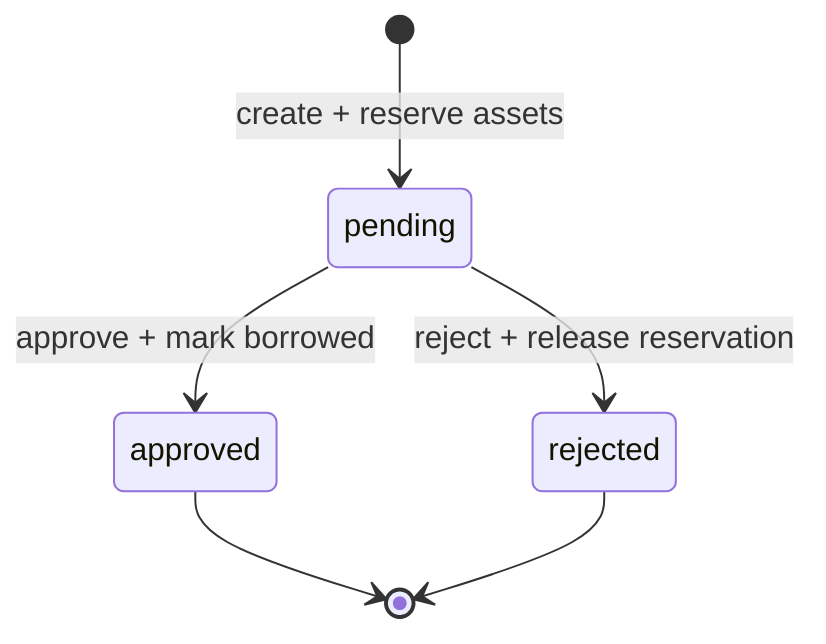
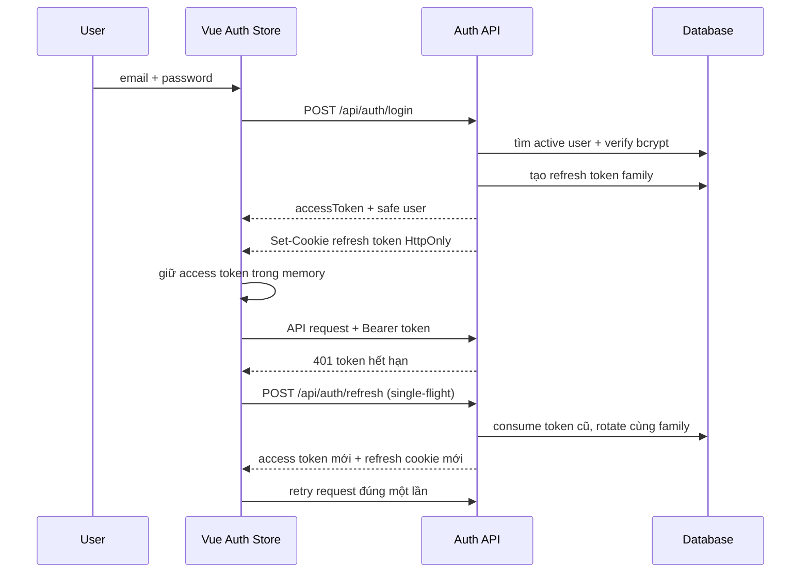
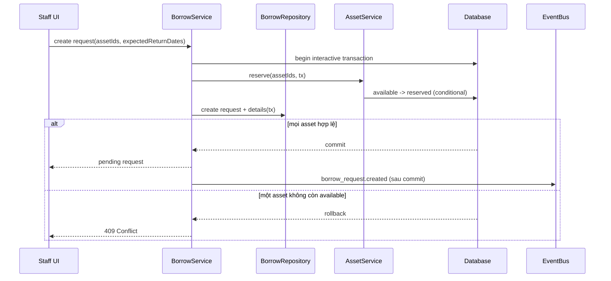
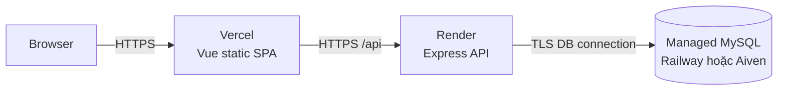

# BigIn Asset Management — System Design

> Tài liệu kiến trúc tổng thể của hệ thống quản lý tài sản nội bộ BigIn.
>
> Cập nhật gần nhất: **2026-07-27**
>
> Trạng thái: **Living document**
>
> Phạm vi: `apps/frontend`, `apps/backend`, Prisma schema, RBAC, prototype Stitch,
> vận hành và lộ trình hoàn thiện MVP.

## 1. Mục đích tài liệu

Tài liệu này trả lời các câu hỏi:

- Hệ thống giải quyết bài toán gì và có những actor nào?
- Frontend, backend và database được chia lớp ra sao?
- Module nào sở hữu dữ liệu và nghiệp vụ nào?
- Luồng đăng nhập, mượn/trả, sửa chữa và quản trị người dùng hoạt động thế nào?
- Phần nào đã có trong source, phần nào mới có prototype và phần nào vẫn là thiết
  kế mục tiêu?
- Khi triển khai tiếp cần tuân theo boundary, transaction, security và design
  system nào?

Tài liệu không thay thế feature spec chi tiết. Requirement theo từng module vẫn
nằm trong [`docs/modules`](../docs/modules/); schema database chuẩn vẫn là
[`apps/backend/prisma/schema.prisma`](../apps/backend/prisma/schema.prisma).

## 2. Quy ước trạng thái và nguồn sự thật

### 2.1 Ký hiệu trạng thái

| Ký hiệu | Ý nghĩa |
|---|---|
| **Implemented** | Có source runtime, đã đăng ký route hoặc được app sử dụng |
| **Partial** | Có một phần source nhưng chưa thành vertical slice hoàn chỉnh |
| **Prototype** | Đã thiết kế/kiểm tra trên Stitch, chưa đồng nghĩa đã code vào Vue |
| **Target** | Kiến trúc hoặc feature đã chốt hướng nhưng chưa triển khai |

### 2.2 Thứ tự ưu tiên khi tài liệu mâu thuẫn

1. Source và migration đang chạy.
2. [`schema.prisma`](../apps/backend/prisma/schema.prisma).
3. `implementation.md` của module.
4. Constitution, architecture docs và module spec.
5. Prototype Stitch và prompt mockup.
6. Tài liệu hướng dẫn cũ hoặc code trong thư mục học tập.

Quy tắc này đặc biệt quan trọng vì repository còn một số tài liệu cũ mô tả
Express JavaScript hoặc schema trước migration. Không dùng những nội dung đó để
ghi đè trạng thái thực tế của source TypeScript hiện tại.

### 2.3 Ba tài liệu thiết kế ở thư mục này

- [`DESIGN.md`](DESIGN.md): token và nguyên lý Ant Design nền.
- [`DESIGN_SYSTEM.md`](DESIGN_SYSTEM.md): quy chuẩn UI/UX bắt buộc của BigIn,
  gồm layout, view, list/table, form, component, responsive và accessibility.
- `SYSTEM_DESIGN.md`: kiến trúc phần mềm, data, module, workflow, security,
  deployment và trạng thái triển khai.

`DESIGN.md` dùng ngôn ngữ Ant Design v6 làm chuẩn hình ảnh. Project frontend hiện
là Vue 3 và **chưa cài Ant Design Vue trong `package.json`**, vì vậy các API React
như `ConfigProvider`, `theme.useToken()` chỉ là tài liệu tham chiếu upstream.
Khi code Vue, phải ánh xạ token sang Ant Design Vue hoặc CSS variables phù hợp,
không import API React vào Vue.

## 3. Tổng quan sản phẩm

BigIn Asset Management là web application nội bộ để quản lý vòng đời thiết bị:

- quản lý thiết bị, thương hiệu, loại và model;
- cho nhân viên xem thiết bị và tạo yêu cầu mượn;
- cho quản lý tài sản duyệt/từ chối, bàn giao và nhận trả;
- ghi nhận thiết bị hỏng và quá trình sửa chữa;
- quản lý người dùng, phòng ban, vai trò và quyền;
- lưu lịch sử để truy vết ai mượn, ai duyệt và thiết bị đã được xử lý thế nào.

Ngoài phạm vi hiện tại:

- mua sắm, kế toán, khấu hao và quản lý nhà cung cấp;
- SSO/OAuth, xác minh email và quên mật khẩu tự phục vụ;
- mobile app native;
- Kafka/RabbitMQ, distributed saga hoặc microservice;
- email/push notification ở MVP đầu tiên.

## 4. Actor, role và authorization

### 4.1 Actor chính

| Role hệ thống | Trách nhiệm chính | Phạm vi giao diện |
|---|---|---|
| `staff` | Xem thiết bị, tạo và theo dõi yêu cầu của mình, xem lịch sử của mình | Tổng quan, Thiết bị, Yêu cầu của tôi, Lịch sử mượn |
| `asset_manager` | Quản lý catalog/asset, duyệt đơn, check-in/out và sửa chữa | Tổng quan, Thiết bị, Chờ phê duyệt, Lịch sử mượn, Sửa chữa, Danh mục |
| `admin` | Quản trị toàn hệ thống, user, department, RBAC và có toàn bộ quyền vận hành | Toàn bộ vùng nghiệp vụ và Quản trị |

Role là nhóm quyền, không phải điều kiện authorization được hard-code. Backend
luôn kiểm theo `permissions.code`; một user có thể có nhiều role.

### 4.2 Permission model

- Flat RBAC, không có role hierarchy.
- Không hỗ trợ wildcard như `asset.*`.
- Access token chứa `sub` và mảng `permissionCodes`.
- Frontend ẩn/disable menu và action để tạo UX đúng.
- Backend middleware vẫn là nơi ra quyết định cuối cùng.
- Không có cơ chế “super admin bỏ qua mọi permission”.
- Đổi role chỉ có hiệu lực với access token mới hoặc sau refresh/expiry.

Registry chuẩn có 50 permission code tại
[`permission-registry.md`](../docs/architecture/permission-registry.md), chia theo:

- dashboard;
- department;
- brand, asset type, asset model;
- asset;
- borrow request, borrow history;
- repair log;
- user;
- role và role assignment;
- permission management.

`role.create/update/delete` và `permission.create/update/delete` có trong registry
định hướng nhưng chưa có API quản trị runtime. Hiện role, permission và
`role_permissions` được coi là dữ liệu hệ thống do seed/migration quản lý.

## 5. System context



Hệ thống hiện là modular monolith:

- một Vue SPA;
- một Express API process;
- một database MariaDB/MySQL;
- boundary theo module ở code thay vì tách thành nhiều service triển khai độc lập.

Cách này phù hợp MVP vì giữ transaction mượn/trả nhiều bảng trong một database,
đồng thời vẫn cho phép tách module sau này nếu thực sự cần.

## 6. Cấu trúc repository

```text
train_Bigin_SE/
├── apps/
│   ├── frontend/              # Vue 3, Vite, Pinia, Vue Router
│   └── backend/               # Express 5, TypeScript, Prisma
├── design/
│   ├── DESIGN.md              # Visual design system
│   └── SYSTEM_DESIGN.md       # Tài liệu này
├── docs/
│   ├── architecture/          # Constitution, boundaries, schema, permissions
│   ├── modules/               # Spec/plan/tasks/implementation theo module
│   └── implementation-status/ # Snapshot triển khai chi tiết
├── tooling/                   # Codex harness, không phải runtime app
├── training/                  # Bài học/thử nghiệm, không phải production app
└── nuxt-nodejs-boilerplate/   # Tham khảo, không phải runtime chính
```

Workspace runtime chỉ gồm `apps/*` theo `pnpm-workspace.yaml`.

## 7. Kiến trúc runtime tổng thể

### 7.1 Luồng request



### 7.2 Nguyên tắc dependency

```text
route → middleware → controller → service → repository contract
                                             ↓
                                      Prisma repository → database
```

- Controller không chứa business rule.
- Service không phụ thuộc trực tiếp Express request/response.
- Repository không quyết định permission hay HTTP status.
- Module khác gọi public service, không import Prisma repository nội bộ.
- Chỉ module Asset được đổi `assets.status`.
- Chỉ module RBAC được ghi `user_roles` và `role_permissions`.
- Transaction liên module phải truyền cùng `Prisma.TransactionClient`.

### 7.3 Trạng thái thực tế cần lưu ý

Kiến trúc mục tiêu yêu cầu error handling tập trung, nhưng `BaseController` hiện
vẫn tự `try/catch` và trả `500` tại controller. Đây là **Partial**, chưa phải
centralized error pipeline hoàn chỉnh.

Dependency injection hiện được lắp thủ công trong từng route file. Cách này đơn
giản và phù hợp quy mô hiện tại; nếu module tăng mạnh mới cân nhắc composition
root/container riêng.

## 8. Ma trận trạng thái module

| Module | Backend | Frontend Vue | Stitch | Ghi chú |
|---|---|---|---|---|
| Auth | **Implemented** | Login/refresh/guard **Implemented**; register **Partial** | AUTH-01/02 **Prototype** | Register Vue hiện chỉ validate local |
| Users | **Implemented** | Users route/view **Partial** | USR-01..04 **Prototype** | Deactivate thay cho delete |
| Departments | **Implemented** | **Partial/thiếu flow** | DEP-01 **Prototype** | Không xóa nếu còn user tham chiếu |
| RBAC | Role list + replace roles **Implemented** | **Partial** | RBAC-01..03 **Prototype** | CRUD role/permission chưa có |
| Catalog | Brand/type/model CRUD **Implemented** | File view rời rạc | AST-02/manager flows **Prototype** | Chưa nối router đầy đủ |
| Assets | CRUD, retire, transitions **Implemented** | File view rời rạc | AST-01/03/04/05 **Prototype** | Chưa có frontend vertical slice hoàn chỉnh |
| Borrow | Schema + Asset boundary | Chưa nối API | BOR-01..10 **Prototype** | Không có route/service Borrow |
| Repair | Schema + Asset boundary | Chưa nối API | REP-01..05 **Prototype** | Không có route/service Repair |
| Notification | **Target** | **Target** | Chưa là flow runtime | Chưa có bảng, event bus hay endpoint |
| OpenAPI/Swagger | **Target** | Không áp dụng | Không áp dụng | Chưa có spec hoặc Swagger UI runtime |

Không dùng số lượng screen hoặc file `.vue` làm bằng chứng một feature đã hoàn
thành. Một vertical slice chỉ hoàn thành khi route, authorization, validation,
service, persistence, UI state và verification đều hoạt động cùng nhau.

## 9. Frontend design

### 9.1 Stack hiện tại

- Vue 3.5;
- Vite 8;
- Pinia 3;
- Vue Router 5;
- native `fetch`;
- CSS viết trong asset và Single File Component.

Frontend hiện chưa khai báo `ant-design-vue` trong dependencies. Ant Design đang
là ngôn ngữ thiết kế và prototype chuẩn; việc dùng component library trong code
production vẫn là bước triển khai tiếp theo.

### 9.2 Phân lớp đề xuất

```text
src/
├── views/                 # Page-level route composition
├── components/
│   ├── layout/            # AuthLayout, AppShell, Header, Sidebar
│   ├── common/            # Button wrappers, EmptyState, ConfirmDialog...
│   ├── assets/
│   ├── borrowing/
│   ├── repairs/
│   └── users/
├── stores/                # Session và state chia sẻ toàn app
├── services/              # HTTP/API clients theo module
├── composables/           # Logic Vue tái sử dụng
├── router/                # Route definitions và guards
└── assets/                # Global tokens/styles/static assets
```

Quy tắc:

- `view` là màn hình gắn với route, chịu trách nhiệm ghép component và điều phối
  use case của trang;
- `component` là khối UI tái sử dụng, nhận dữ liệu bằng props và phát event;
- `layout` là khung trang ổn định, đưa nội dung thay đổi vào bằng `<slot />`;
- `store` chỉ giữ state chia sẻ hoặc sống qua nhiều route;
- `service` chịu trách nhiệm HTTP;
- `composable` đóng gói logic Vue tái sử dụng, không phải nơi chứa markup lớn.

### 9.3 Auth layout hiện tại

`Login.vue` và `register.vue` cùng dùng
[`AuthLayout.vue`](../apps/frontend/src/components/layout/AuthLayout.vue).
`AuthLayout` render khung chung và đặt `<slot />` tại vùng form:

```text
AuthLayout
├── Brand/context panel
└── Form panel
    └── <slot /> ← Login form hoặc Register form
```

Điều này giúp responsive layout, branding và footer chỉ được định nghĩa một lần.
`RouterLink` dùng route name để điều hướng SPA mà không reload toàn bộ trang.
`v-model` đồng bộ hai chiều giữa input và reactive form state.

### 9.4 Router và authorization hiện tại

Router đang có:

- guest routes: `/`, `/register`;
- authenticated routes: `/main`, `/dashboard`, `/users`, `/CartItem`;
- permission guard mẫu: `/users` yêu cầu `user.view`.

`beforeEach` khôi phục session trước, sau đó:

1. redirect guest nếu route cần auth nhưng chưa có session;
2. redirect dashboard nếu user đã đăng nhập mở guest page;
3. redirect dashboard nếu thiếu permission trong route meta.

Các screen Asset, Borrow, Repair và phần lớn Admin chưa được đăng ký đầy đủ trong
router production.

### 9.5 Session và API client hiện tại

Pinia auth store:

- giữ access token trong memory;
- gửi refresh token qua HttpOnly cookie với `credentials: 'include'`;
- dùng một `refreshPromise` để tránh nhiều request refresh đồng thời;
- tự thử refresh một lần khi API trả `401`;
- xóa session nếu refresh thất bại;
- cung cấp `hasPermission(code)` cho router/view.

Hiện HTTP client nằm trong `stores/auth.js`. Khi số module tăng, cần tách transport
ra `services/api-client` nhưng vẫn giữ single-flight refresh ở một nơi duy nhất.

### 9.6 Khoảng trống của Register

Register view hiện:

- chỉ validate trên frontend;
- không gọi `POST /api/auth/register`;
- dùng `username` và `confirmPassword`, trong khi backend cần DTO phù hợp với
  `users` như name, email, phone, department và password;
- redirect về login bằng query `registered=1`.

Trước khi nối backend phải thống nhất form contract, danh sách department và cách
hiển thị lỗi unique/FK; client không bao giờ được gửi role hoặc permission để tự
nâng quyền.

## 10. Visual design system và AppShell

Chuẩn đầy đủ nằm ở [`DESIGN.md`](DESIGN.md). Token chủ đạo:

| Vai trò | Token |
|---|---|
| Brand primary | `#FF6B00` |
| Primary hover / active | `#FF8533` / `#D95A00` |
| Success / warning / error / info | `#52C41A` / `#FAAD14` / `#FF4D4F` / `#007BFF` |
| Page / panel / inset | `#F5F5F5` / `#FFFFFF` / `#FAFAFA` |
| Text primary / secondary | `#1F1F1F` / `#595959` |
| Border / subtle border | `#D9D9D9` / `#F0F0F0` |
| Selected navigation | nền `#FFF2E6`, chữ/icon `#FF6B00` |

Authenticated desktop AppShell đã chốt trên Stitch:

- canvas kiểm thử: `1280 × 1024`;
- sidebar: `248px`, nền trắng;
- header: `64px`, nền trắng;
- user name, role và avatar luôn ở góc phải header;
- nội dung dùng nền `#F5F5F5`, panel/table nền trắng;
- control cao `32px`, radius `6px`; surface radius `8px`;
- base font `14px`; weight chỉ `400` và `600`;
- spacing theo lưới `4px`;
- orange chỉ dùng cho active state, focus/link và một primary action nổi trội;
- green, blue, teal hoặc dark không được dùng làm màu kết cấu sidebar/header.

Prototype đã audit 34 màn hình ứng dụng desktop:

| Nhóm | Screen |
|---|---|
| Auth | AUTH-01, AUTH-02 |
| Staff | DASH-01, AST-01, BOR-01..05 |
| Asset Manager | DASH-02, BOR-06..09, AST-03..05, REP-01..05 |
| Admin | DASH-03, USR-01..04, DEP-01, AST-02, BOR-10, RBAC-01..03, SYS-403 |

Canvas Stitch có thêm một node hiển thị `DESIGN.md`, nên tổng node là 35; node đó
không phải screen runtime.

Stitch mới xác nhận fixed desktop composition. Responsive behavior phải được code
và test ở Vue bằng CSS Grid/Flex:

- desktop: sidebar cố định + header + content;
- tablet: sidebar collapse/drawer, toolbar có thể wrap;
- mobile: một cột, table chuyển horizontal scroll hoặc list có chọn lọc;
- không ẩn action nghiệp vụ quan trọng chỉ vì viewport nhỏ.

Lưu ý accessibility: white text trên brand orange có thể không đạt WCAG AA cho
small text. Khi triển khai component thật phải kiểm tra contrast và dùng token
primary tối hơn hoặc text màu phù hợp, thay vì tạo màu one-off.

## 11. Backend design

### 11.1 Stack

- Node.js;
- Express 5;
- TypeScript chạy NodeNext;
- Zod validation;
- Prisma 7 với MariaDB adapter;
- MariaDB/MySQL;
- JWT access token;
- refresh token rotation;
- bcrypt.

`tsconfig` hiện có `strict: false`; tăng dần type safety là technical debt cần xử
lý theo module, không bật strict toàn repo mà không có kế hoạch migration.

### 11.2 Route composition

Route file hiện là composition root cục bộ:

```text
Prisma client
  → PrismaRepository
  → Service
  → Controller
  → Router + auth/RBAC middleware
```

`createRestRouter` tạo contract CRUD chuẩn:

- `GET /`;
- `GET /:id`;
- `POST /`;
- `PATCH /:id`;
- `DELETE /:id`.

Route đặc thù được thêm bên cạnh generic CRUD, ví dụ:

- `PATCH /api/users/:id/activate`;
- `POST /api/assets/:id/report-damaged`.

### 11.3 Validation và response

- Zod parse request body ở controller.
- ID cần guard riêng nếu route yêu cầu positive integer.
- Success response: `{ "data": ... }`.
- Validation response: `{ "error": "...", "details": ... }`.
- Các lỗi chuẩn: `400`, `401`, `403`, `404`, `409`, `500`.
- `204` không có response body.

Không trả Prisma entity chứa password hoặc secret trực tiếp ra API.

### 11.4 API đang hoạt động

| Method | Endpoint | Auth/permission |
|---|---|---|
| GET | `/health` | Public |
| POST | `/api/auth/register` | Public, role mặc định an toàn |
| POST | `/api/auth/login` | Public |
| POST | `/api/auth/refresh` | Refresh cookie |
| POST | `/api/auth/logout` | Refresh cookie/current family |
| CRUD | `/api/users` | `user.view/create/update/delete` theo action |
| PATCH | `/api/users/:id/activate` | `user.update` |
| CRUD | `/api/departments` | `department.*` theo action |
| CRUD | `/api/brands` | `brand.*` theo action |
| CRUD | `/api/asset-types` | `asset_type.*` theo action |
| CRUD | `/api/asset-models` | `asset_model.*` theo action |
| CRUD | `/api/assets` | `asset.*` theo action |
| POST | `/api/assets/:id/report-damaged` | `asset.update` |
| GET | `/api/rbac/roles` | `role.assign` |
| PUT | `/api/rbac/users/:userId/roles` | `role.assign` |

Chưa có endpoint cho:

- borrow requests và borrow histories;
- repairs;
- notifications;
- CRUD role/permission/permission matrix;
- OpenAPI JSON hoặc Swagger UI.

API hiện chưa có version segment (`/api/v1`) và `GET all` chưa có pagination
contract thống nhất. Hai việc này cần được chốt trước khi lượng dữ liệu hoặc số
client tăng.

## 12. Module boundaries

| Module | Sở hữu | Được gọi bởi | Không được làm |
|---|---|---|---|
| Auth | `refresh_tokens`, token/session use cases | Router, Users khi revoke session | CRUD user/RBAC trực tiếp |
| Users | `users`, `departments` | Auth, Borrow, Repair | Ghi `user_roles` trực tiếp |
| RBAC | `roles`, `permissions`, `role_permissions`, `user_roles` | Auth, Users, middleware | Quản lý profile/password |
| Asset | `assets`, `brands`, `asset_types`, `asset_models`, asset state machine | Borrow, Repair | Quyết định approval/repair business flow |
| Borrow | `borrow_requests`, details, histories | UI, Notification event consumer | Update `assets.status` trực tiếp |
| Repair | `repair_logs` | UI, Notification event consumer | Update `assets.status` trực tiếp |
| Notification | Notification data và delivery | Domain event handlers | Query repository nội bộ module khác |

Cross-module rule:

```text
BorrowService ──calls──> AssetService
RepairService ──calls──> AssetService
Users/Auth ──calls──> RbacService
Users ──calls──> SessionService
```

Không có chiều ngược lại tạo circular dependency.

## 13. Data design

### 13.1 Entity relationship



### 13.2 Ràng buộc quan trọng

- `users.email` và `users.phone` unique.
- `users.is_active` mặc định `true`.
- `refresh_tokens.jti` unique.
- `assets.qr_code` unique.
- `assets.serial_number` nullable nhưng unique khi có giá trị.
- asset model unique theo `(brand_id, asset_type_id, name)`.
- một asset không lặp trong cùng request:
  `(borrow_request_id, asset_id)` unique.
- một detail có tối đa một borrow history.
- role-permission và user-role dùng composite primary key.
- `repair_logs.cost` là decimal và không âm ở business rule.

User không bị xóa vật lý; `DELETE /users/:id` mang semantics deactivate.
Asset không bị xóa vật lý; delete mang semantics chuyển sang `retired`.
Lookup chỉ được hard delete khi không còn reference.

### 13.3 Dữ liệu chưa có

Schema hiện không có:

- `notifications`;
- `notification_deliveries`;
- `outbox_events`.

Không thêm các bảng này trước khi bắt đầu phase Notification tương ứng.

## 14. State machines

### 14.1 Asset lifecycle



Mọi transition phải:

- đi qua `AssetService`;
- nêu trạng thái nguồn kỳ vọng;
- dùng conditional update;
- trả conflict nếu trạng thái đã đổi bởi transaction khác;
- giữ `retired` là trạng thái cuối.

### 14.2 Borrow request



Database enum hiện chỉ có `pending`, `approved`, `rejected`.
Permission `borrow_request.cancel_own` đã tồn tại nhưng `cancelled` chưa có trong
enum; không được tự thêm UI state thứ tư nếu chưa cập nhật spec, migration,
transaction và test.

### 14.3 Repair lifecycle

Repair không có enum riêng; vòng đời được biểu diễn bởi `repair_logs.end_date` và
asset status:

```text
damaged
  → start repair: tạo open repair_log + asset = in_repair
  → close repaired: end_date/cost/result + asset = available
  → close failed: end_date/cost/result + asset = damaged
```

Một asset chỉ được có tối đa một repair log đang mở.

## 15. Workflow chi tiết

### 15.1 Login và refresh rotation — Implemented



Security rule:

- access token: 15 phút;
- refresh token: 7 ngày;
- refresh token raw không lưu trong DB; DB lưu `jti` và metadata;
- reuse token đã dùng làm revoke toàn bộ family;
- logout revoke current family;
- inactive user không được login/refresh.

### 15.2 Tạo yêu cầu mượn — Target



### 15.3 Duyệt hoặc từ chối — Target

Duyệt trong một transaction:

1. conditional update request `pending → approved`;
2. ghi `approved_by`, `approved_at`;
3. gọi `AssetService.markBorrowed(..., tx)`;
4. tạo borrow histories;
5. commit;
6. publish `borrow_request.approved`.

Từ chối trong một transaction:

1. conditional update request `pending → rejected`;
2. ghi người xử lý, thời điểm và lý do;
3. gọi `AssetService.releaseReservation(..., tx)`;
4. commit;
5. publish `borrow_request.rejected`.

Hai người duyệt đồng thời chỉ được một transaction thành công.

### 15.4 Trả thiết bị và sửa chữa — Target

Trả từng asset:

1. ghi `borrow_histories.return_date`;
2. condition `good` gọi `returnAsset` về `available`;
3. condition `damaged` gọi `returnAsset` sang `damaged`;
4. commit rồi publish `asset.returned`.

Nếu damaged:

1. Asset Manager mở repair;
2. tạo `repair_log` và gọi `startRepair` trong cùng transaction;
3. khi kết thúc, nhập cost, note và result;
4. result `repaired` về `available`, `failed` về `damaged`;
5. event chỉ publish sau commit.

### 15.5 Admin tạo user — Implemented backend

1. route yêu cầu `user.create`;
2. nếu payload có `roleIds`, caller phải có thêm `role.assign`;
3. validate department và unique email/phone;
4. hash password;
5. tạo user;
6. gọi `RbacService.assignRoles(..., tx)` trong cùng transaction;
7. nếu không có role, gán `staff`;
8. chỉ trả safe user DTO.

## 16. Transaction, consistency và concurrency

### 16.1 Nguyên tắc

- Service điều phối use case là nơi mở transaction.
- Repository và public service liên quan nhận cùng `tx`.
- Không mở nested transaction cho một use case.
- Không gọi email, HTTP provider hoặc publish event bên trong transaction.
- Event chỉ publish sau khi transaction resolve thành công.
- Update state phải kèm expected source state.

### 16.2 Race conditions phải có test

- hai request cùng reserve một asset;
- approve và reject cùng một pending request;
- hai người bắt đầu repair cùng asset damaged;
- refresh token bị dùng đồng thời/reuse;
- deactivate user trong khi session refresh.

Hiện auth có unit coverage cho một phần concurrency; Borrow và Repair chưa có test
runtime vì module chưa triển khai.

## 17. Authentication và security

### 17.1 Trust boundaries

```text
Browser input = untrusted
JWT = trusted chỉ sau verify signature/expiry/schema
permissionCodes = trusted chỉ từ JWT đã verify
Database constraints = lớp bảo vệ cuối cho unique/FK
Frontend guard = UX, không phải security boundary
```

### 17.2 Controls hiện có

- bcrypt cho password;
- secret chỉ đọc từ environment;
- JWT verify ở `requireAuth`;
- permission verify ở `requirePermission`;
- HttpOnly refresh cookie;
- `sameSite=lax`, `secure` ở production;
- CORS chỉ cho `FRONTEND_ORIGIN`, có credentials;
- Zod validation;
- safe DTO không trả password;
- refresh rotation/reuse detection;
- deactivate user + revoke refresh families.

### 17.3 Rủi ro và phần cần hoàn thiện

- access token cũ của user vừa bị deactivate có thể còn hiệu lực tối đa 15 phút;
- `strict: false` giảm bảo đảm type-level;
- controller error handling chưa tập trung và chưa có request correlation ID;
- chưa có rate limit cho auth endpoints;
- chưa có CSRF strategy được tài liệu hóa riêng cho cookie-auth operation;
- chưa có audit log cho action nhạy cảm;
- chưa có password reset/email verification/SSO;
- frontend legacy CSS vẫn chứa màu và component không theo design system.

## 18. Notification architecture — Target

Notification không được gọi trực tiếp từ Borrow/Repair. Boundary mục tiêu:

```text
Business module
  → domain event sau commit
  → Notification event handler
  → NotificationService
      ├── InApp channel
      └── Email channel (future)
```

Lộ trình:

1. in-process event bus + In-App notifications;
2. email best-effort bằng channel adapter;
3. transactional outbox + retry khi yêu cầu delivery guarantee.

Event mục tiêu:

- `borrow_request.created`;
- `borrow_request.approved`;
- `borrow_request.rejected`;
- `asset.returned`;
- `asset.status_changed`;
- `repair.started`;
- `repair.completed`.

Mọi consumer phải idempotent theo `eventId`; Notification phải scope dữ liệu theo
user đang xác thực.

## 19. API documentation / Swagger — Target

Repository hiện chưa có OpenAPI spec và chưa mount Swagger UI.

Khi triển khai:

- OpenAPI document là contract thô cho toàn bộ API;
- mount Swagger UI ở `/api-docs`;
- expose JSON ở `/api-docs/openapi.json`;
- mô tả cookie refresh và Bearer access token thành hai security scheme riêng;
- mỗi endpoint ghi request schema, success envelope và toàn bộ lỗi
  `400/401/403/404/409/500`;
- generate/validate spec trong CI để tránh lệch source;
- không đưa secret, token thật hoặc dữ liệu cá nhân vào example.

Ưu tiên tài liệu endpoint đang hoạt động trước; Borrow/Repair chỉ thêm vào OpenAPI
khi route thật đã được implement.

## 20. Deployment design

Mô hình triển khai đề xuất hiện tại:



### 20.1 Backend environment

- `DB_HOST`
- `DB_PORT`
- `DB_USER`
- `DB_PASSWORD`
- `DB_NAME`
- `DATABASE_URL` cho Prisma migration CLI
- `JWT_SECRET`
- `JWT_EXPIRES_IN`
- `REFRESH_TOKEN_SECRET`
- `REFRESH_TOKEN_EXPIRES_IN`
- `DEFAULT_REGISTER_ROLE_NAME`
- `FRONTEND_ORIGIN`
- `PORT`

Runtime Prisma adapter dùng nhóm `DB_*`; Prisma CLI migration dùng
`DATABASE_URL`. Hai cấu hình phải trỏ cùng database đúng environment.

### 20.2 Frontend environment

- `VITE_API_BASE_URL`

Chỉ biến có prefix `VITE_` mới được bundle vào browser; tuyệt đối không đặt secret
trong frontend env.

### 20.3 Build và migration

```text
pnpm install
pnpm --filter backend typecheck
pnpm --filter backend build
pnpm build:frontend
prisma migrate deploy
pnpm start:backend
```

Migration phải chạy trước khi traffic mới dùng schema mới. Không sửa trực tiếp
generated Prisma client.

## 21. Observability và vận hành

Hiện health endpoint chỉ trả `{ status: "ok" }` và server log URL khi start.
Baseline production cần bổ sung:

- structured JSON logging;
- request/correlation ID;
- log auth/security event đã loại PII và secret;
- error reporting;
- latency, error rate và DB connection metrics;
- readiness check tách khỏi liveness nếu deployment cần;
- audit trail cho approve/reject, role assignment, deactivate và asset transition;
- backup/restore test cho database;
- retention policy cho history, audit và notification.

Không log password, raw JWT, refresh cookie hoặc full personal profile.

## 22. Performance và scalability

Thiết kế hiện ưu tiên correctness. Các điểm cần xử lý trước khi dữ liệu lớn:

- pagination/filter/sort cho `GET all`;
- index theo trạng thái và thời gian cho request/history/asset;
- tránh N+1 khi load model/brand/type hoặc role/permission;
- giới hạn payload và số asset trong một borrow request;
- connection pool phù hợp với số instance backend;
- cache chỉ thêm sau khi đo; permission hiện nằm trong access token nên không query
  DB mỗi request;
- background worker chỉ cần khi Notification/email/outbox được triển khai.

Không tách microservice chỉ để “scale kiến trúc”. Trước hết giữ module boundary,
đo bottleneck và scale stateless API instance.

## 23. Accessibility và responsive quality gate

Mỗi screen production phải kiểm:

- điều hướng keyboard và focus visible;
- label/description/error gắn đúng input;
- trạng thái không chỉ biểu diễn bằng màu;
- modal/drawer giữ focus và trả focus sau khi đóng;
- table có header semantic và action có accessible name;
- contrast đạt mục tiêu WCAG AA;
- zoom 200% không mất action;
- không overflow ngang ngoài vùng table có chủ đích;
- desktop, tablet và mobile đều có loading, empty, error, forbidden và disabled
  state.

Prototype Stitch là visual reference, không thay thế browser test.

## 24. Testing strategy

### 24.1 Backend hiện có

- unit test password hashing;
- auth middleware;
- auth service;
- user service;
- RBAC service;
- asset service;
- database integration test cho user API;
- race-condition integration test.

Lệnh:

```text
pnpm --filter backend test
pnpm --filter backend test:db
pnpm --filter backend typecheck
pnpm --filter backend build
```

`test:db` cần database test riêng và chạy tuần tự.

### 24.2 Frontend hiện có

Frontend package chưa có script test/typecheck/lint riêng. Verification tối thiểu:

```text
pnpm build:frontend
```

Cần bổ sung:

- unit test store/composable;
- component test cho form/table/dialog;
- router guard tests;
- end-to-end test cho login, permission routing và các vertical slice;
- responsive visual regression cho AppShell.

### 24.3 Definition of done cho feature

Một feature chỉ hoàn thành khi:

1. spec và permission code đã chốt;
2. route/controller/service/repository đúng boundary;
3. validation và error contract đầy đủ;
4. transaction/race condition được xử lý;
5. Vue route/view/component nối API thật;
6. loading/empty/error/forbidden/disabled state có đủ;
7. automated verification pass;
8. implementation status và System Design được cập nhật nếu có thay đổi kiến trúc.

## 25. MVP và lộ trình đề xuất

### Phase A — Củng cố nền hiện có

- đồng bộ frontend tokens với `DESIGN.md`;
- tạo production AppShell thay cho Header/Sidebar legacy;
- tách API client khỏi auth store nhưng giữ single-flight refresh;
- nối Register với backend DTO thật;
- đăng ký route và hoàn thiện Users/Departments/Assets;
- chuẩn hóa error middleware;
- thêm OpenAPI cho endpoint đang chạy.

### Phase B — Borrow vertical slice

- chốt cancel semantics và migration nếu cần;
- repository/service/controller/routes;
- create + reserve transaction;
- approve/reject + history;
- check-in good/damaged;
- concurrency tests;
- nối các screen BOR đã prototype.

### Phase C — Repair vertical slice

- enforce một open repair log;
- start/close repair transaction;
- test cost/date/state transition;
- nối REP screens.

### Phase D — Notification

- in-process event bus;
- in-app notification table/API/UI;
- event publish after commit;
- email/outbox chỉ thêm khi có requirement delivery rõ.

### Phase E — Hardening

- pagination/index/performance;
- structured logging/audit;
- security rate limit/CSRF review;
- frontend automated tests;
- accessibility và responsive regression;
- CI build/test/OpenAPI validation.

## 26. Quyết định kiến trúc đã chốt

| ID | Quyết định | Lý do |
|---|---|---|
| ADR-001 | Modular monolith | Đơn giản vận hành và giữ transaction đa bảng |
| ADR-002 | Permission-based authorization | Không hard-code role, linh hoạt khi nhiều role/user |
| ADR-003 | JWT ngắn hạn + refresh rotation | Request nhanh, giảm rủi ro token dài hạn |
| ADR-004 | AssetService là owner duy nhất của status | Giữ state machine nhất quán |
| ADR-005 | Deactivate/retire thay hard delete | Bảo toàn lịch sử và định danh |
| ADR-006 | Interactive transaction cho workflow liên module | Atomic create/reserve/approve/return/repair |
| ADR-007 | Publish event sau commit | Không tạo side effect từ transaction rollback |
| ADR-008 | Ant Design light + BigIn orange | UI enterprise nhất quán với brand |
| ADR-009 | Prototype không đồng nghĩa implementation | Tránh đánh giá sai tiến độ từ số lượng screen |

## 27. Open decisions

- Public register có tiếp tục mở ở production hay chỉ admin tạo tài khoản?
- DTO register cuối cùng gồm những field nào và chọn department ra sao?
- Có thêm `cancelled` vào borrow request state machine không?
- Quy tắc overdue và job phát hiện quá hạn là gì?
- Có giới hạn số asset đang mượn trên một user/request không?
- Role/permission có tiếp tục là fixed system data hay cần CRUD runtime?
- Có cần revoke access token gần real-time khi deactivate/đổi quyền?
- Email provider và event nào cần delivery guarantee?
- API có versioning `/api/v1` trước khi public hóa contract không?
- Mục tiêu SLO, retention, audit và backup cụ thể là gì?

## 28. Tài liệu liên quan

- [BigIn UI/UX Design System](DESIGN_SYSTEM.md)
- [Visual Design System](DESIGN.md)
- [System Overview](../docs/architecture/system-overview.md)
- [Module Boundaries](../docs/architecture/module-boundaries.md)
- [Architecture Constitution](../docs/architecture/constitution.md)
- [Permission Registry](../docs/architecture/permission-registry.md)
- [Database Schema Guide](../docs/architecture/database-schema.md)
- [Prisma Schema](../apps/backend/prisma/schema.prisma)
- [Deployment Guide](../docs/deployment-guide.md)
- [Stitch Ant Design Progress](../apps/frontend/STITCH_ANT_DESIGN_PROGRESS.md)
- [Auth Spec](../docs/modules/auth/spec.md)
- [Users Spec](../docs/modules/users/spec.md)
- [Assets Spec](../docs/modules/assets/spec.md)
- [RBAC Spec](../docs/modules/rbac/spec.md)
- [Borrow Spec](../docs/modules/borrow/spec.md)
- [Repair Spec](../docs/modules/repair/spec.md)
- [Notification Spec](../docs/modules/notifications/spec.md)
