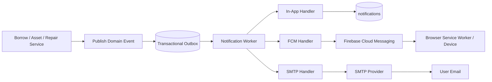

# Notification Architecture & Delivery Roadmap

Status: **Proposed — design and rollout guide, not yet fully implemented**  
Scope: In-app notification, Observer/Publisher–Subscriber, Firebase Cloud Messaging (FCM) Web Push and SMTP email.

## 1. Mục tiêu

Hệ thống phải có khả năng:

- Tạo notification từ các event nghiệp vụ quan trọng mà không làm Borrow/Repair/Asset phụ thuộc vào từng channel.
- Hiển thị notification trong ứng dụng.
- Gửi FCM Web Push khi user không mở web page.
- Gửi email qua SMTP.
- Retry khi FCM/SMTP tạm thời lỗi.
- Không mất event sau khi nghiệp vụ chính đã commit.
- Không gửi trùng khi worker xử lý lại cùng một event.
- Có thể thêm channel mới như SMS mà không sửa các service nghiệp vụ.

### 1.1. Điều không được làm

- Không gọi FCM, SMTP hoặc HTTP provider bên trong Prisma transaction.
- Không để Borrow/Repair/Asset import trực tiếp Prisma repository của Notification.
- Không hard-code recipient theo tên role; recipient phải được xác định từ user, permission và entity liên quan.
- Không xem Observer in-process là cơ chế đảm bảo giao nhận. Process dừng sau commit vẫn có thể làm mất event nếu chưa có Outbox.
- Không ghi access token FCM, SMTP password hoặc service-account private key vào frontend, log hoặc repository.

## 2. Baseline hiện tại

Notification in-app đã có các lớp chính:

```text
NotificationController
        ↓
NotificationService
        ↓
INotificationRepository
        ↓
PrismaNotificationRepository
        ↓
notifications
```

Một số workflow hiện tại vẫn tạo notification trực tiếp qua repository:

- `BorrowWorkflowService` gọi `notifications.create(...)` khi approve, reject, handover và return.
- `AssetIssueService` gọi `notificationRepository.create(...)` khi issue/repair thay đổi trạng thái.
- Frontend dùng browser event `notifications:changed` để refresh unread badge trong cùng tab.

Đây là nền tảng có thể mở rộng vì repository đã được inject qua interface. Tuy nhiên, đây chưa phải Observer Pattern hoàn chỉnh: chưa có domain event envelope, event bus, subscriber registry hoặc durable delivery queue.

## 3. Kiến trúc mục tiêu



### 3.1. Luồng chuẩn

1. Service nghiệp vụ hoàn tất quyết định và cập nhật aggregate.
2. Service ghi domain event vào `outbox_events` trong cùng transaction với thay đổi nghiệp vụ.
3. Transaction commit thành công.
4. Worker đọc các outbox event đã commit.
5. Dispatcher tìm các subscriber phù hợp.
6. Mỗi channel tạo hoặc gửi delivery riêng.
7. Worker cập nhật trạng thái `pending`, `sent`, `failed`, số lần retry và lỗi cuối.

Nếu bước nghiệp vụ rollback, event cũng rollback. Nếu FCM/SMTP lỗi sau khi nghiệp vụ đã commit, worker retry mà không làm rollback nghiệp vụ.

## 4. Event contract

Mọi domain event dùng một envelope thống nhất:

```ts
interface DomainEvent<TPayload = unknown> {
  eventId: string;          // UUID, idempotency key
  eventType: string;       // borrow_request.approved
  eventVersion: number;    // bắt đầu từ 1
  occurredAt: string;      // ISO-8601 UTC
  aggregateType: string;   // BORROW_REQUEST, ASSET_ISSUE...
  aggregateId: number;
  actorUserId: number | null;
  correlationId: string | null;
  payload: TPayload;
}
```

### 4.1. Event MVP đề xuất

| Event | Recipient chính | Payload tối thiểu |
|---|---|---|
| `borrow_request.created` | User có permission xử lý request | `requestId`, `requesterId` |
| `borrow_request.approved` | Requester | `requestId`, `detailId`, `approverId` |
| `borrow_request.rejected` | Requester | `requestId`, `detailId`, `approverId`, `reason` |
| `asset.handed_over` | Requester | `requestId`, `detailId`, `assetId` |
| `asset.returned` | Requester hoặc người liên quan | `requestId`, `detailId`, `assetId`, `condition` |
| `asset_issue.reported` | User có permission xử lý issue | `issueId`, `assetId`, `reporterId` |
| `asset_issue.confirmed` | Reporter và user liên quan | `issueId`, `assetId`, `actorId` |
| `repair.started` | Reporter hoặc requester liên quan | `issueId`, `assetId`, `actorId` |
| `repair.completed` | Reporter hoặc requester liên quan | `issueId`, `assetId`, `result`, `actorId` |
| `repair.failed` | Reporter hoặc requester liên quan | `issueId`, `assetId`, `reason`, `actorId` |

Chỉ phát event cho thay đổi có ý nghĩa nghiệp vụ. Không phát event cho các thao tác CRUD tầm thường như đổi avatar hoặc đổi số điện thoại.

## 5. Các phase triển khai

### Phase 0 — Chốt contract và notification matrix

Mục tiêu: chốt event, recipient và channel policy trước khi refactor code.

#### Công việc

- Chốt danh sách event ở mục 4.1.
- Chốt recipient cho từng event bằng user/permission/entity.
- Chốt notification type, title, message và logical reference.
- Quy định channel mặc định:
  - `in_app`: bật cho event MVP.
  - `fcm`: bật khi user đã đăng ký browser/device token.
  - `email`: bật theo preference hoặc event quan trọng.
- Chốt timezone hiển thị: `Asia/Ho_Chi_Minh`; timestamp lưu UTC.
- Chốt event version và idempotency key.

#### Kết quả cần có

- Event catalog.
- Recipient/channel matrix.
- Template catalog cho in-app, FCM và email.
- Acceptance criteria cho từng event.

#### Điều kiện hoàn thành

- Không còn event nào có recipient hoặc channel policy mơ hồ.
- Product/BA xác nhận các event được gửi và không gửi.

### Phase 1 — Event contract và In-process Observer

Mục tiêu: tách service nghiệp vụ khỏi việc tạo notification trực tiếp.

#### Cấu trúc đề xuất

```text
apps/backend/src/events/
  domain-event.ts
  event-types.ts
  event-bus.ts
  event-subscriber.ts

apps/backend/src/notifications/
  notification-dispatcher.ts
  notification-handler.ts
  handlers/in-app-notification.handler.ts
  templates/
```

#### Cách hoạt động

```ts
await repository.transaction(async (tx) => {
  await workflow.changeBusinessState(tx);
  await eventStore.append({ ...event, eventId }, tx);
});

// Chỉ với Phase 1, publish sau khi transaction commit thành công.
await eventBus.publish(event);
```

Subscriber không được ném lỗi ngược làm hỏng response nghiệp vụ đã commit. Dùng `Promise.allSettled` và log lỗi theo subscriber.

#### Lưu ý quan trọng

Phase 1 dùng event bus trong process nên event vẫn có thể mất nếu process dừng ngay sau commit. Vì vậy Phase 1 chỉ phù hợp để refactor coupling và triển khai in-app best-effort, không đủ cho yêu cầu FCM/SMTP tin cậy.

#### Kiểm thử

- Service nghiệp vụ chỉ publish event, không gọi `NotificationRepository` trực tiếp.
- Subscriber nhận đúng event type.
- Một subscriber lỗi không làm workflow đổi thành lỗi.
- Event chỉ publish sau transaction commit.

### Phase 2 — Transactional Outbox và Worker

Mục tiêu: đảm bảo event không mất và có thể retry bền vững. Phase này phải hoàn thành trước FCM/SMTP production.

#### Bảng `outbox_events`

```text
id                BIGINT/INT primary key
event_id          VARCHAR(36) unique not null
event_type        VARCHAR(120) not null
event_version     INT not null
aggregate_type    VARCHAR(80) not null
aggregate_id      INT not null
payload           JSON not null
occurred_at       DATETIME not null
status            pending | processing | processed | failed
attempt_count     INT not null default 0
next_attempt_at   DATETIME null
locked_at         DATETIME null
processed_at      DATETIME null
last_error        TEXT null
created_at        DATETIME not null
```

Nên bổ sung index cho:

```text
(status, next_attempt_at, created_at)
(aggregate_type, aggregate_id)
```

#### Worker

Worker thực hiện:

1. Lấy một batch event `pending` đến hạn.
2. Lock event để tránh nhiều worker xử lý cùng lúc.
3. Deserialize và validate event envelope.
4. Dispatch đến các handler.
5. Ghi trạng thái delivery.
6. Nếu tất cả channel hoàn tất, đánh dấu `processed`.
7. Nếu lỗi tạm thời, tăng `attempt_count`, đặt `next_attempt_at` theo exponential backoff.
8. Nếu quá số lần thử, chuyển `failed` và đưa vào dead-letter/admin review.

#### Nguyên tắc idempotency

- `event_id` là unique.
- Mỗi handler phải kiểm tra event đã xử lý chưa.
- FCM/email delivery cần unique key dạng `(event_id, recipient_id, channel)`.
- Worker có thể chạy lại an toàn mà không tạo notification trùng.

#### Retry policy đề xuất

```text
attempt 1: 30 giây
attempt 2: 2 phút
attempt 3: 10 phút
attempt 4: 30 phút
attempt 5: 2 giờ
```

Lỗi token FCM không hợp lệ phải deactivate token, không retry vô hạn. Lỗi SMTP authentication/configuration phải đưa vào alert vận hành.

### Phase 3 — In-app Notification Handler

Mục tiêu: chuyển cách tạo notification hiện tại sang event subscriber nhưng giữ nguyên API F07.

#### Công việc

- `InAppNotificationHandler` nhận event chuẩn.
- Resolve recipient bằng permission/entity public query.
- Ghi một row vào `notifications` cho mỗi recipient.
- Giữ `related_entity_type` và `related_entity_id` là logical reference, không tạo FK sang bảng nghiệp vụ.
- Giữ nguyên API:
  - `GET /api/notifications`
  - `GET /api/notifications/unread-count`
  - `PATCH/POST mark-read` theo contract hiện tại.
- Xóa dần các lời gọi `notificationRepository.create` nằm rải rác trong Borrow/Repair/Asset sau khi handler đã bao phủ đủ event.

#### Acceptance criteria

- Approve/reject/handover/return và issue/repair tạo đúng in-app notification.
- Notification chỉ xuất hiện sau khi business transaction commit.
- Không có notification trùng khi worker/event được xử lý lại.
- User chỉ xem và mark-read notification của chính mình.

### Phase 4 — FCM Web Push

Mục tiêu: gửi push đến browser/device ngay cả khi user không mở web page.

#### Frontend

- Thêm Firebase Web SDK.
- Thêm Service Worker ở public path, ví dụ `/firebase-messaging-sw.js`.
- Xin quyền notification sau hành động rõ ràng của user, không xin ngay khi load app.
- Lấy FCM registration token và gửi token lên backend.
- Xử lý token refresh và unregister khi user logout hoặc browser revoke permission.
- Service Worker xử lý:
  - background message;
  - notification click;
  - mở route liên quan bằng `relatedEntityType` và `relatedEntityId`.

#### Backend data model đề xuất

```text
notification_devices
  id                 primary key
  user_id            indexed foreign key to users
  provider           fcm
  token              unique
  platform           web
  user_agent         nullable
  last_seen_at       datetime
  is_active          boolean
  failure_count      int
  last_error         text nullable
  created_at         datetime
  updated_at         datetime
```

API đề xuất:

```text
POST   /api/notification-devices
DELETE /api/notification-devices/:id
GET    /api/notification-devices
```

Backend phải kiểm tra user hiện tại khi tạo/xóa token. Token không được trả cho user khác.

#### FCM channel handler

- Nhận event từ worker.
- Lấy các device token active của recipient.
- Gửi payload tối thiểu:

```json
{
  "notification": {
    "title": "Borrow request approved",
    "body": "An item in your request was approved."
  },
  "data": {
    "eventId": "...",
    "relatedEntityType": "BORROW_REQUEST",
    "relatedEntityId": "123"
  }
}
```

- Token invalid/unregistered: deactivate token.
- FCM timeout/rate limit/5xx: retry qua Outbox worker.
- Service account credential chỉ nằm ở backend secret store/env server.

#### Giới hạn cần nói rõ với người dùng

FCM Web Push cho phép browser nhận thông báo khi web page đã đóng, nếu user đã cấp quyền và browser/OS vẫn hỗ trợ push. Không thể cam kết tuyệt đối khi user chặn notification, browser bị tắt hoàn toàn, OS tiết kiệm pin hoặc token đã hết hiệu lực.

### Phase 5 — SMTP Email Channel

Mục tiêu: gửi email cho event cần thông báo qua email.

#### Backend

Tạo abstraction:

```ts
interface EmailProvider {
  send(input: {
    to: string;
    subject: string;
    html: string;
    text: string;
    idempotencyKey: string;
  }): Promise<void>;
}
```

`SmtpEmailProvider` chỉ được gọi từ worker/channel handler, không được gọi trong business transaction.

#### Cấu hình cần có

```text
SMTP_HOST
SMTP_PORT
SMTP_SECURE
SMTP_USER
SMTP_PASSWORD
SMTP_FROM
SMTP_REPLY_TO
```

Không log password, SMTP URL đầy đủ hoặc email content có dữ liệu nhạy cảm.

#### Template và policy

- Template phải có plain text fallback.
- Subject có event type dễ tìm kiếm.
- Email chứa deep link an toàn, không chứa access token.
- Có preference cho user: email bật/tắt theo event.
- Email critical có thể không cho tắt nếu business policy yêu cầu.

#### Delivery tracking

Nên thêm `notification_deliveries`:

```text
id
event_id
notification_id nullable
recipient_user_id
channel            in_app | fcm | email
status             pending | sent | failed
attempt_count
provider_message_id nullable
last_error nullable
sent_at nullable
created_at
updated_at
```

Unique key đề xuất:

```text
(event_id, recipient_user_id, channel)
```

### Phase 6 — Preferences, quan sát và vận hành

Mục tiêu: kiểm soát channel và vận hành production.

#### Preferences

```text
notification_preferences
  user_id
  event_type
  in_app_enabled
  fcm_enabled
  email_enabled
```

Default policy phải được áp dụng khi chưa có row preference. Không cho user tắt các notification bắt buộc nếu business rule yêu cầu.

#### Metrics và logs

Theo dõi:

- số event pending/processing/failed;
- tuổi event pending lâu nhất;
- tỷ lệ FCM success/failure;
- tỷ lệ email success/failure;
- số token FCM invalid;
- số retry trung bình;
- thời gian từ event commit đến delivery.

Mọi log phải có `eventId`, `eventType`, `recipientUserId` và `channel`, nhưng không log secret/token đầy đủ.

#### Admin operations

- Màn hình xem failed delivery/dead-letter.
- Retry thủ công một event an toàn theo idempotency key.
- Disable token hoặc email address lỗi.
- Alert khi outbox backlog vượt ngưỡng.

## 6. Folder structure đề xuất

```text
apps/backend/src/
  events/
    domain-event.ts
    event-types.ts
    event-bus.ts
    event-store.ts
    subscribers/
  notifications/
    notification-dispatcher.ts
    notification-recipient.service.ts
    handlers/
      in-app-notification.handler.ts
      fcm-notification.handler.ts
      email-notification.handler.ts
    channels/
      fcm.provider.ts
      email.provider.ts
    outbox/
      outbox.repository.ts
      outbox.worker.ts
      retry-policy.ts
```

Frontend:

```text
apps/frontend/src/
  services/notification.service.js
  services/fcm.service.js
  firebase-messaging-sw.js
```

## 7. Testing strategy

### Unit tests

- Event envelope validation.
- Event-to-recipient mapping.
- Subscriber dispatch với `Promise.allSettled`.
- Idempotency khi xử lý cùng event hai lần.
- Retry/backoff policy.
- Invalid FCM token bị deactivate.
- SMTP transient error được retry.
- SMTP permanent error chuyển `failed`.

### Integration tests

- Business transaction rollback thì không có outbox event.
- Commit business transaction tạo đúng một outbox event.
- Worker tạo đúng in-app notification.
- Worker retry không tạo duplicate delivery.
- FCM/SMTP mock provider nhận payload đúng.
- User không thể đăng ký/xóa device token của user khác.

### End-to-end tests

- User cấp quyền browser → token được lưu.
- Approve borrow → in-app notification xuất hiện, FCM mock được gọi, email mock được gọi theo preference.
- Đóng web page → service worker nhận background push.
- Click push → mở đúng entity route và vẫn kiểm tra permission.

## 8. Rollout và rollback

### Rollout

1. Deploy schema mới trước code worker.
2. Deploy event contract và feature flag tắt channel ngoài.
3. Bật In-app handler.
4. Bật Outbox worker với concurrency thấp.
5. Bật FCM cho nhóm test nội bộ.
6. Bật SMTP cho nhóm test nội bộ.
7. Tăng dần tỷ lệ user/channel sau khi metrics ổn định.

### Rollback

- Tắt feature flag FCM/SMTP, không xóa outbox hoặc delivery history.
- Worker tiếp tục giữ event pending để xử lý lại sau.
- Không rollback business transaction chỉ vì channel notification lỗi.
- Chỉ rollback schema sau khi đã xác nhận không còn worker dùng các bảng mới.

## 9. Definition of Done tổng thể

- Borrow/Repair/Asset không gọi trực tiếp Notification repository để phát event.
- Event contract versioned và có `eventId` unique.
- Outbox ghi cùng transaction nghiệp vụ.
- Worker có lock, retry, idempotency và dead-letter handling.
- In-app, FCM và SMTP là các channel độc lập.
- FCM token được quản lý theo user/device và token invalid được vô hiệu hóa.
- SMTP secret không nằm trong frontend hoặc log.
- Có metrics, alert và thao tác retry cho failed delivery.
- Có unit, integration và end-to-end coverage cho success/failure/retry.

## 10. Khuyến nghị triển khai

Không nên nhảy thẳng từ cách gọi repository hiện tại sang FCM/SMTP. Thứ tự an toàn là:

```text
Phase 0: Contract
→ Phase 1: Observer/Event Bus
→ Phase 2: Outbox/Worker
→ Phase 3: In-app migration
→ Phase 4: FCM
→ Phase 5: SMTP
→ Phase 6: Preferences/Operations
```

Lý do: Observer giúp tách coupling, nhưng Outbox mới đảm bảo event không mất khi process restart hoặc provider tạm thời lỗi. FCM và SMTP chỉ nên bật production sau khi Phase 2 hoàn tất.
