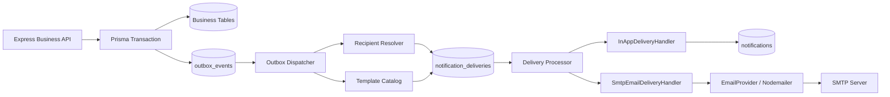

# Kế hoạch triển khai Observer + Transactional Outbox cho Notification

## Trạng thái tài liệu

- Trạng thái: **IMPLEMENTED — VERIFIED**. Tiến độ chi tiết và evidence nằm tại
  `docs/plans/2026-08-21-notification-outbox-remediation-checklist.md`.
- Ngày lập: 2026-08-19.
- Phạm vi triển khai chính: notification in-app hiện có và email qua SMTP.
- FCM Web Push: kiến trúc có điểm mở rộng nhưng chưa nằm trong implementation scope của kế hoạch này.
- Public API F07 hiện tại được giữ nguyên.
- Tài liệu này không tự thay đổi Business Rule hoặc Acceptance Criteria.

## 1. Quyết định kiến trúc

Chọn kiến trúc:

```text
Business transaction
→ outbox_events
→ Outbox Dispatcher
→ resolve recipients
→ notification_deliveries
→ Delivery Processor
   ├── InAppDeliveryHandler
   └── SmtpEmailDeliveryHandler
```

Đây là mô hình **Observer/Publisher–Subscriber kết hợp Transactional Outbox**.
Observer giúp business service không phụ thuộc vào cách gửi notification.
Outbox giúp event không bị mất giữa lúc database đã commit và lúc worker bắt
đầu xử lý.

Không gửi SMTP trực tiếp trong request xử lý nghiệp vụ. Không dùng event bus
chỉ nằm trong memory làm cơ chế bảo đảm giao nhận.

## 2. Baseline trước remediation (historical)

Các dòng dưới đây ghi lại trạng thái trước khi outbox được thêm; chúng không mô
tả implementation hiện tại. Gap và evidence hiện hành nằm trong remediation checklist.

| Thành phần hiện tại | Evidence | Nhận xét |
| --- | --- | --- |
| API đọc và đánh dấu notification | `apps/backend/src/routes/notification.routes.ts`, `notification.controller.ts` | Đã có và tiếp tục giữ nguyên |
| Notification service | `apps/backend/src/services/notification.service.ts` | Vừa phục vụ read API, vừa bị business workflow gọi trực tiếp để tạo notification |
| Notification repository | `apps/backend/src/repositories/notification.prisma.repository.ts` | Ghi trực tiếp bảng `notifications` trong business transaction |
| Borrow request | `apps/backend/src/services/borrow-request.service.ts` | Gọi trực tiếp `notifyPermissionHoldersInTransaction(...)` |
| Approval, handover, return | `apps/backend/src/services/borrow-workflow.service.ts` | Gọi trực tiếp `createInTransaction(...)` hoặc resolve permission recipient |
| Asset issue và repair | `apps/backend/src/services/asset-issue.service.ts` | Gọi trực tiếp notification service |
| Database | `apps/backend/prisma/schema.prisma` | Chỉ có bảng `notifications`; chưa có `outbox_events` và `notification_deliveries` |
| Tests | `apps/backend/tests/borrow-lifecycle.integration.test.ts`, `asset-issue-notification.integration.test.ts` | Kiểm chứng synchronous in-app notification hiện tại; chưa có worker/retry/idempotency tests |

Luồng hiện tại:

```text
Business Service
→ NotificationService
→ NotificationRepository
→ notifications
```

Ưu điểm của luồng hiện tại là business state và in-app notification cùng
rollback nếu transaction lỗi. Hạn chế là business service biết trực tiếp về
notification, không thể gửi SMTP an toàn và không có retry độc lập cho channel.

## 3. Trả lời 4W

### What — Triển khai cái gì?

Triển khai một pipeline notification bền vững gồm:

1. Domain event mô tả sự kiện nghiệp vụ đã xảy ra.
2. Bảng `outbox_events` lưu event cùng transaction nghiệp vụ.
3. Outbox Dispatcher đọc event, xác định recipient và tạo delivery.
4. Bảng `notification_deliveries` quản lý từng recipient và từng channel.
5. Delivery Processor gọi các Observer độc lập:
   - `InAppDeliveryHandler` ghi notification trong hệ thống.
   - `SmtpEmailDeliveryHandler` gửi email qua `EmailProvider`.
6. Các worker loop chạy trong cùng Node.js process với Express.
7. Retry, idempotency, stale-lock recovery, structured logging và audit.

### Why — Tại sao triển khai như vậy?

- Business API không phải chờ SMTP.
- SMTP lỗi không làm approve, handover, return hoặc issue bị rollback.
- Event không mất nếu API process dừng ngay sau khi business transaction commit.
- Thêm channel mới không cần sửa toàn bộ business service.
- Recipient vẫn dựa trên effective permission, không hard-code role.
- Có lịch sử delivery để biết notification đã gửi, retry, fail hay bị skip.
- Worker restart hoặc xử lý lại không tạo in-app notification/delivery row trùng.
- Tách retry event khỏi retry channel, tránh cùng một lỗi bị retry ở hai nơi.

### Who — Thành phần và đối tượng nào tham gia?

| Thành phần | Trách nhiệm |
| --- | --- |
| Borrow/Approval/Handover/Return/Issue service | Thay đổi business state và ghi domain event |
| Outbox repository | Ghi, claim và cập nhật trạng thái event |
| Outbox Dispatcher | Validate event, resolve recipient, snapshot template và tạo delivery |
| Recipient Resolver | Tìm user trực tiếp hoặc active user có effective permission hiện tại |
| Delivery repository | Claim delivery, quản lý retry và audit trạng thái |
| Delivery Processor | Chọn observer theo channel và cô lập lỗi giữa các channel |
| InAppDeliveryHandler | Tạo row trong bảng `notifications` |
| SmtpEmailDeliveryHandler | Gọi `EmailProvider` bằng dữ liệu snapshot |
| EmailProvider | Abstraction để implementation dùng Nodemailer/SMTP |
| Notification runtime | Các loop dispatcher/processor chạy cùng Express trong một Node.js process |
| Employee/Asset Manager/Admin | Recipient nghiệp vụ; runtime vẫn xác định bằng user hoặc permission |

### When — Xử lý vào thời điểm nào?

1. Event được ghi **trong cùng transaction** với business mutation.
2. Event chỉ nhìn thấy bởi worker sau khi transaction commit.
3. Dispatcher xử lý event ngay ở polling cycle tiếp theo.
4. Delivery được gửi bất đồng bộ sau khi được tạo.
5. Delivery lỗi tạm thời được retry theo backoff.
6. Notification in-app có eventual consistency: có thể xuất hiện sau vài giây.
7. SMTP và FCM không bao giờ được gọi bên trong business transaction.

## 4. Các phương án đã cân nhắc

| Phương án | Ưu điểm | Vấn đề | Quyết định |
| --- | --- | --- | --- |
| Gửi SMTP trực tiếp trong service | Ít code, dễ demo | API chậm; provider lỗi làm nghiệp vụ lỗi; khó retry | Không chọn |
| Observer in-process | Giảm coupling | Process crash sau commit có thể làm mất event; memory không durable | Chỉ dùng interface/dispatch concept, không dùng làm reliability boundary |
| Observer + Transactional Outbox + delivery queue | Durable, retry được, channel độc lập, audit rõ | Thêm schema, worker và vận hành | **Chọn** |

## 5. Phạm vi và boundary

### Trong scope triển khai

- Domain event cho borrow request, detail approval, borrow history và asset issue.
- `outbox_events` và `notification_deliveries`.
- Outbox Dispatcher và Delivery Processor.
- In-app observer.
- SMTP observer qua Nodemailer nằm sau `EmailProvider` abstraction.
- Worker loops chạy cùng Express trong một Node.js process.
- Sáu lần thử lại sau lần xử lý ngay, idempotency và stale lock recovery.
- Integration tests cho transaction, dispatch, delivery, retry và duplicate.
- Cập nhật active requirement/spec trước khi code vì email hiện đang được ghi là out of scope.

### Ngoài scope triển khai hiện tại

- FCM Web Push và browser service worker.
- SMS.
- Notification preference UI.
- Admin UI xem dead-letter/retry.
- Public/admin API mới cho outbox hoặc delivery.
- Exactly-once SMTP.
- Thay đổi public API đọc/mark-read notification F07.

FCM có thể được thêm sau bằng một channel `FCM` và một
`FcmNotificationObserver`, nhưng phải được duyệt scope, contract device-token,
schema token và frontend service worker riêng.

## 6. Kiến trúc mục tiêu



### Boundary bắt buộc

- Business service chỉ biết `DomainEventWriter`, không biết SMTP hoặc channel.
- Outbox chỉ bảo đảm domain event được dispatch thành delivery.
- `notification_deliveries` mới quản lý retry của từng channel.
- Observer không quyết định business state.
- Recipient resolver không hard-code `Admin`, `Manager` hoặc `Employee`.
- Express và notification runtime dùng chung một composition root và một Node.js process.

## 7. Domain event contract

```ts
interface DomainEvent<TPayload> {
  eventId: string
  eventType: string
  eventVersion: 1
  aggregateType:
    | 'BORROW_REQUEST'
    | 'BORROW_REQUEST_DETAIL'
    | 'BORROW_HISTORY'
    | 'ASSET_ISSUE'
  aggregateId: number
  actorUserId: number | null
  correlationId: string | null
  occurredAt: string
  payload: TPayload
}
```

Quy tắc:

- `eventId` là UUID duy nhất và là idempotency reference.
- `eventType` mô tả business fact, không mô tả hành động gửi thông báo.
- `eventVersion` bắt đầu từ `1`; thay đổi breaking payload phải tăng version.
- `occurredAt` lưu ISO-8601 UTC.
- Payload chỉ chứa ID và dữ liệu cần để resolve/template; không chứa secret.
- Không dùng event tên `notify_requester` hoặc `send_email_to_manager`.

## 8. Event → recipient → channel matrix

| Event | Aggregate | Recipient | Channel phase này |
| --- | --- | --- | --- |
| `borrow_request.created` | `BORROW_REQUEST` | Active user có `borrow_request.view_all` hoặc `borrow_request.approve`, loại requester | IN_APP, EMAIL |
| `borrow_request_detail.approved` | `BORROW_REQUEST_DETAIL` | Requester ID trong event | IN_APP, EMAIL |
| `borrow_request_detail.rejected` | `BORROW_REQUEST_DETAIL` | Requester ID trong event | IN_APP, EMAIL |
| `borrow_history.handed_over` | `BORROW_HISTORY` | Requester ID trong event | IN_APP, EMAIL |
| `borrow_history.returned` | `BORROW_HISTORY` | Requester ID trong event | IN_APP, EMAIL |
| `borrow_history.returned_damaged` | `BORROW_HISTORY` | Requester ID trong event | IN_APP, EMAIL |
| `asset_issue.reported` | `ASSET_ISSUE` | Active user có `asset_issue.view` hoặc `asset_issue.update`, loại reporter | IN_APP, EMAIL |
| `asset_issue.created_from_damaged_return` | `ASSET_ISSUE` | Active user có `asset_issue.view` hoặc `asset_issue.update`, loại actor/reporter | IN_APP, EMAIL |
| `asset_issue.confirmed` | `ASSET_ISSUE` | Reporter ID trong event | IN_APP, EMAIL |
| `asset_issue.rejected` | `ASSET_ISSUE` | Reporter ID trong event | IN_APP, EMAIL |
| `asset_issue.repair_started` | `ASSET_ISSUE` | Reporter ID trong event | IN_APP, EMAIL |
| `asset_issue.repair_completed` | `ASSET_ISSUE` | Reporter ID trong event | IN_APP, EMAIL |
| `asset_issue.repair_failed` | `ASSET_ISSUE` | Reporter ID trong event | IN_APP, EMAIL |

Approve All vẫn phát một event cho mỗi detail thực sự được approve. Điều này
giữ đúng aggregate và trạng thái per-detail; không tạo một business event giả
chỉ để gửi một email chung.

Damaged return ghi hai business facts trong cùng transaction:

```text
borrow_history.returned_damaged
asset_issue.created_from_damaged_return
```

## 9. Recipient policy

### Recipient trực tiếp

Requester hoặc reporter cụ thể được lưu bằng user ID trong event. Dispatcher
đọc user đó để snapshot địa chỉ email.

### Recipient theo permission

Dispatcher truy vấn **effective permission hiện tại tại thời điểm dispatch**.
Không snapshot role name và không giới hạn theo department trong MVP.

Ví dụ:

```text
borrow_request.created
→ dispatcher tìm active users hiện có permission phù hợp
→ loại requester
→ tạo delivery
```

### Inactive user

- Recipient trực tiếp đã inactive: tạo delivery IN_APP và EMAIL ở trạng thái
  `SKIPPED`, reason `USER_INACTIVE`, để audit rõ.
- Recipient theo permission: resolver chỉ lấy active users nên không tạo
  delivery cho inactive user.
- Delivery Processor kiểm tra lại user trước khi send; nếu user vừa bị
  deactivate thì đổi delivery thành `SKIPPED/USER_INACTIVE`.

## 10. Schema cuối của `outbox_events`

| Field | Kiểu đề xuất | Rule |
| --- | --- | --- |
| `id` | `BIGINT` | Primary key, auto increment |
| `event_id` | `VARCHAR(36)` | Unique, UUID |
| `event_type` | `VARCHAR(120)` | Not null |
| `event_version` | `INT` | Not null, default 1 |
| `aggregate_type` | `VARCHAR(50)` | Một trong 4 aggregate đã chốt |
| `aggregate_id` | `INT` | ID của aggregate |
| `actor_user_id` | `INT NULL` | Logical actor reference |
| `correlation_id` | `VARCHAR(64) NULL` | Trace request/workflow |
| `payload` | `JSON` | Event payload versioned |
| `occurred_at` | `DATETIME(3)` | UTC business event time |
| `status` | enum/string | `PENDING`, `PROCESSING`, `DISPATCHED`, `FAILED` |
| `dispatch_attempt_count` | `INT` | Default 0 |
| `next_attempt_at` | `DATETIME(3) NULL` | Due time cho retry dispatcher |
| `locked_at` | `DATETIME(3) NULL` | Worker lease time |
| `locked_by` | `VARCHAR(100) NULL` | Worker instance ID |
| `dispatched_at` | `DATETIME(3) NULL` | Khi tạo delivery hoàn tất |
| `last_error` | `TEXT NULL` | Lỗi sanitized |
| `created_at` | `DATETIME(3)` | Default now |
| `updated_at` | `DATETIME(3)` | Auto update |

Index:

```text
UNIQUE(event_id)
INDEX(status, next_attempt_at, created_at)
INDEX(aggregate_type, aggregate_id)
INDEX(status, locked_at)
```

Outbox không lưu retry của SMTP hoặc in-app. Nó chỉ retry việc resolve và tạo
delivery.

## 11. Schema cuối của `notification_deliveries`

| Field | Kiểu đề xuất | Rule |
| --- | --- | --- |
| `id` | `BIGINT` | Primary key, auto increment |
| `event_id` | `VARCHAR(36)` | Reference đến outbox event |
| `recipient_user_id` | `INT` | FK user |
| `channel` | enum/string | `IN_APP`, `EMAIL`; `FCM` chỉ thêm ở phase khác |
| `status` | enum/string | `PENDING`, `PROCESSING`, `SENT`, `FAILED`, `SKIPPED` |
| `recipient_address` | `VARCHAR(255) NULL` | Email snapshot; null cho IN_APP |
| `notification_type` | `VARCHAR(50)` | Tương thích F07 read model |
| `title_snapshot` | `VARCHAR(255)` | Rendered title/subject |
| `text_body_snapshot` | `TEXT` | Rendered text body |
| `related_entity_type` | `VARCHAR(50) NULL` | Logical reference |
| `related_entity_id` | `INT NULL` | Logical reference |
| `notification_id` | `INT NULL` | FK tới in-app notification sau khi tạo |
| `outbound_message_id` | `VARCHAR(255) NULL` | ID do BigIn tạo trước khi gửi; EMAIL dùng làm deterministic Message-ID |
| `provider_message_id` | `VARCHAR(255) NULL` | Provider response nếu có |
| `attempt_count` | `INT` | Default 0 |
| `next_attempt_at` | `DATETIME(3) NULL` | Due time |
| `locked_at` | `DATETIME(3) NULL` | Lease time |
| `locked_by` | `VARCHAR(100) NULL` | Worker instance ID |
| `sent_at` | `DATETIME(3) NULL` | Hoàn tất channel |
| `skipped_at` | `DATETIME(3) NULL` | Bị skip |
| `skip_reason` | `VARCHAR(100) NULL` | `SMTP_DISABLED`, `USER_INACTIVE`, `EMAIL_MISSING`... |
| `last_error` | `TEXT NULL` | Lỗi sanitized |
| `created_at` | `DATETIME(3)` | Default now |
| `updated_at` | `DATETIME(3)` | Auto update |

Constraint/index:

```text
UNIQUE(event_id, recipient_user_id, channel)
UNIQUE(notification_id)
INDEX(status, next_attempt_at, created_at)
INDEX(recipient_user_id, channel, status)
INDEX(status, locked_at)
```

EMAIL delivery phải snapshot địa chỉ, template version và rendered content khi
delivery được tạo. Retry không đọc lại email/template mới.

## 12. State machine

### Outbox event

```text
PENDING
  → PROCESSING
      → DISPATCHED
      → PENDING  (lỗi tạm thời, còn retry)
      → FAILED   (lỗi vĩnh viễn hoặc hết retry)

PROCESSING quá 5 phút
  → được worker khác reclaim
```

`DISPATCHED` nghĩa là delivery rows đã được tạo thành công. Nó không có nghĩa
email đã được gửi.

### Notification delivery

```text
PENDING
  → PROCESSING
      → SENT
      → SKIPPED
      → PENDING  (lỗi tạm thời, còn retry)
      → FAILED   (lỗi vĩnh viễn hoặc hết retry)

PROCESSING quá 5 phút
  → được worker khác reclaim
```

Terminal states: `SENT`, `SKIPPED`, `FAILED`.

## 13. Transaction boundary

### Business transaction

```text
BEGIN
  thay đổi borrow/issue/asset/history
  insert outbox event
COMMIT
```

Nếu insert event lỗi, toàn bộ business transaction rollback. Như vậy không có
trạng thái “nghiệp vụ thành công nhưng event bị quên”.

### Dispatch transaction

```text
BEGIN
  claim event
  resolve recipient
  create delivery rows bằng unique key
  mark event DISPATCHED
COMMIT
```

Nếu transaction lỗi, event chưa `DISPATCHED`. Retry tạo cùng delivery key nên
không sinh row trùng.

### In-app delivery transaction

```text
BEGIN
  tạo notifications row nếu chưa có
  link notification_id vào delivery
  mark delivery SENT
COMMIT
```

Điều này loại duplicate in-app notification khi worker restart.

SMTP không thể nằm trong database transaction. Vì vậy email dùng semantics
at-least-once.

## 14. Worker architecture

Worker là các loop nền trong cùng Node.js process với Express, có vòng polling
và graceful shutdown riêng.

```text
notification-worker.ts
  ├── OutboxDispatcher.runBatch()
  └── DeliveryProcessor.runBatch()
```

Worker loop:

1. Poll batch nhỏ, ví dụ 20 row.
2. Claim từng row bằng conditional update; chỉ worker update thành công mới xử lý.
3. Xử lý song song có giới hạn, không dùng concurrency vô hạn.
4. Nếu không có việc, chờ polling interval ngắn.
5. Bắt `SIGTERM`/`SIGINT`, ngừng claim mới và hoàn tất item đang xử lý.
6. Structured log có `eventId`, `eventType`, `recipientUserId`, `channel`.

Một process có hai loop logic, nhưng Dispatcher và Processor vẫn là hai service
tách biệt. Không để lỗi EMAIL rollback delivery IN_APP.

## 15. Retry và idempotency

### Retry schedule

```text
initial attempt: ngay lập tức
retry 1: sau 30 giây
retry 2: sau 2 phút
retry 3: sau 10 phút
retry 4: sau 30 phút
retry 5: sau 2 giờ
sau đó: FAILED
```

### Phân loại lỗi

- Transient: timeout, connection reset, SMTP 4xx thích hợp, DB connection tạm
  thời → retry.
- Permanent: payload/template không hợp lệ, email thiếu/sai policy, SMTP auth
  sai → `FAILED` hoặc `SKIPPED` theo reason đã xác định.
- Không lưu raw credential, full token hoặc stack nhạy cảm vào `last_error`.

### Idempotency

- `event_id` unique ngăn ghi một domain event hai lần.
- `(event_id, recipient_user_id, channel)` unique ngăn delivery row trùng.
- `notification_id` unique và transaction in-app ngăn notification row trùng.
- SMTP dùng deterministic `Message-ID`, ví dụ từ event, recipient và channel.
- Worker chỉ dispatch event chưa hoàn tất và claim bằng conditional update.

### SMTP delivery semantics

Contract bắt buộc:

> Delivery is at-least-once. Database delivery records are idempotent, but
> duplicate SMTP delivery is still theoretically possible during crash windows.

Crash window:

```text
SMTP đã nhận email
→ worker crash trước khi update SENT
→ delivery được retry
→ user có thể nhận email lần hai
```

Deterministic `Message-ID` giảm khả năng duplicate nhưng không chứng minh
exactly-once vì SMTP provider có thể không deduplicate.

## 16. Behavior theo trường hợp lỗi

### Worker crash

- Business API vẫn thành công nếu transaction đã commit.
- Row đang `PROCESSING` được reclaim sau lock timeout 5 phút.
- Unique keys bảo vệ database khỏi duplicate.
- SMTP vẫn có crash window at-least-once như mục 15.

### SMTP disabled

Khi `SMTP_ENABLED=false`:

- IN_APP vẫn xử lý bình thường.
- EMAIL delivery vẫn được tạo.
- EMAIL delivery chuyển `SKIPPED` với `skip_reason=SMTP_DISABLED`.
- Không âm thầm bỏ delivery vì cần audit rõ.

### User inactive

- EMAIL: `SKIPPED/USER_INACTIVE`.
- IN_APP: `SKIPPED/USER_INACTIVE`.
- Permission resolver không chọn inactive user.
- Processor recheck để xử lý trường hợp user bị deactivate sau dispatch.

### Một channel lỗi

EMAIL lỗi không đổi trạng thái của IN_APP và ngược lại. Delivery Processor cập
nhật từng row độc lập.

### Worker dừng lâu

Event/delivery giữ `PENDING`. Khi worker chạy lại, các row đến hạn tiếp tục
được xử lý. Business transaction không bị rollback và notification chỉ bị trễ.

## 17. Eventual consistency

Sau thay đổi này:

```text
Business API trả success
→ notification có thể xuất hiện sau vài giây
```

Đây là behavior change so với cách ghi notification trực tiếp hiện tại. Public
HTTP contract F07 không đổi, nhưng active requirement/spec/test phải ghi rõ:

- notification là eventually consistent;
- API nghiệp vụ thành công không đồng nghĩa channel đã gửi xong;
- worker dừng làm notification bị delay, không làm nghiệp vụ fail.

## 18. Given–When–Then acceptance scenarios

### GWT-01 — Ghi event cùng business transaction

```gherkin
Given một borrow request hợp lệ được tạo
When service commit borrow request
Then có đúng một outbox event borrow_request.created trong cùng transaction
And chưa cần có notification hoặc SMTP delivery ngay trong HTTP response
```

### GWT-02 — Rollback không để lại event

```gherkin
Given business mutation phát sinh lỗi trước commit
When Prisma transaction rollback
Then business state không thay đổi
And không có outbox event tương ứng
```

### GWT-03 — Dispatcher tạo delivery

```gherkin
Given một outbox event PENDING hợp lệ
When Outbox Dispatcher xử lý event
Then recipient được resolve theo user hoặc effective permission hiện tại
And mỗi recipient có một IN_APP delivery và một EMAIL delivery
And event chuyển thành DISPATCHED
```

### GWT-04 — Dispatch idempotent

```gherkin
Given cùng một event bị dispatcher xử lý lại
When dispatcher tạo delivery bằng cùng eventId, recipient và channel
Then database không tạo delivery row trùng
And event không bị dispatch thêm lần thứ hai sau khi đã hoàn tất
```

### GWT-05 — In-app delivery idempotent

```gherkin
Given một IN_APP delivery PENDING
When InAppDeliveryHandler xử lý thành công
Then có đúng một notifications row cho delivery
And delivery lưu notificationId và chuyển SENT
```

### GWT-06 — SMTP thành công

```gherkin
Given một EMAIL delivery có email và template snapshot hợp lệ
When SMTP provider chấp nhận email
Then delivery chuyển SENT
And sentAt và provider/message reference được lưu
```

### GWT-07 — SMTP lỗi tạm thời

```gherkin
Given SMTP trả lỗi transient
When SmtpEmailDeliveryHandler xử lý delivery
Then business state không bị thay đổi
And delivery quay về PENDING với attemptCount tăng
And nextAttemptAt theo retry schedule
```

### GWT-08 — SMTP disabled

```gherkin
Given SMTP_ENABLED bằng false
When Delivery Processor gặp EMAIL delivery
Then delivery chuyển SKIPPED với reason SMTP_DISABLED
And IN_APP delivery của cùng event vẫn có thể SENT
```

### GWT-09 — Direct recipient inactive

```gherkin
Given requester hoặc reporter trong event đã inactive
When dispatcher hoặc processor kiểm tra recipient
Then IN_APP và EMAIL delivery được audit là SKIPPED USER_INACTIVE
And không gửi notification tới user đó
```

### GWT-10 — Permission recipient dùng quyền hiện tại

```gherkin
Given borrow_request.created chưa được dispatch
And quyền của một user thay đổi sau lúc event commit nhưng trước lúc dispatch
When dispatcher resolve permission recipient
Then hệ thống dùng effective permission tại thời điểm dispatch
And không dùng role name hoặc department để quyết định
```

### GWT-11 — Channel isolation

```gherkin
Given một event có IN_APP và EMAIL delivery
When EMAIL delivery fail
Then IN_APP delivery vẫn được xử lý độc lập
And EMAIL failure không rollback notification in-app
```

### GWT-12 — Stale processing lock

```gherkin
Given worker crash và để row PROCESSING quá 5 phút
When worker khác chạy polling
Then row được reclaim an toàn
And unique key ngăn tạo database record trùng
```

### GWT-13 — Damaged return

```gherkin
Given normal borrow history đang active và asset đang BORROWED
When người có permission xác nhận damaged return
Then business transaction ghi borrow_history.returned_damaged
And ghi asset_issue.created_from_damaged_return
And cả hai event rollback nếu business transaction rollback
```

### GWT-14 — Eventual consistency

```gherkin
Given business API đã trả success
And worker đang tạm dừng
When user mở notification ngay lập tức
Then notification mới có thể chưa xuất hiện
When worker tiếp tục xử lý
Then notification xuất hiện mà không cần chạy lại business operation
```

### GWT-15 — SMTP crash window

```gherkin
Given SMTP đã chấp nhận email
When worker crash trước khi update delivery SENT
Then delivery có thể được retry sau lock timeout
And hệ thống không claim exactly-once delivery
And deterministic Message-ID được tái sử dụng
```

## 19. Implementation plan theo vertical slice

### Phase 0 — Contract và scope gate

Mục tiêu: làm rõ thay đổi trước khi code.

1. Chuyển Email khỏi out-of-scope trong active MVP requirement sau khi owner xác nhận.
2. Bổ sung business rule về eventual consistency, permission-time resolution,
   inactive user, SMTP disabled và at-least-once.
3. Chốt event catalog và template catalog.
4. Không thêm public/admin endpoint trong phase này.
5. OpenAPI F07 chỉ cần sửa nếu public HTTP behavior/schema thay đổi; hiện kế
   hoạch giữ nguyên.

Exit criteria:

- Active requirement không còn mâu thuẫn với SMTP scope.
- Event/recipient/channel matrix được owner duyệt.

### Phase 1 — Forward-compatible database foundation

1. Thêm Prisma enums/models cho outbox và delivery.
2. Tạo migration chỉ add table/index/FK; không xóa hoặc sửa dữ liệu notification cũ.
3. Generate Prisma client.
4. Viết repository contract và Prisma repository.
5. Test unique key, claim, state transition và stale lock.

Exit criteria:

- API cũ vẫn chạy dù worker chưa deploy.
- Migration rollback operational bằng cách tắt code mới; không drop dữ liệu khi rollback app.

### Phase 2 — Domain event writer

1. Tạo event envelope, event types và payload validation.
2. Tạo `DomainEventWriter.append(event, transaction)`.
3. Refactor một vertical slice đầu tiên: `borrow_request.created`.
4. Business mutation và event insert dùng cùng Prisma transaction.
5. Chưa xóa direct notification path cho các flow chưa migrate.

Lý do chọn `borrow_request.created` trước: flow rõ, recipient theo permission và
không phụ thuộc borrow history. Nó kiểm chứng transaction boundary và recipient
resolver trước khi chuyển các workflow phức tạp.

Exit criteria:

- Commit tạo đúng một event.
- Rollback không để event.
- Chưa có regression ở create request.

### Phase 3 — Dispatcher và in-app delivery

1. Tạo recipient resolver.
2. Tạo template catalog có version.
3. Tạo Outbox Dispatcher.
4. Tạo Delivery Processor và InApp observer.
5. Chạy worker chỉ với IN_APP; `SMTP_ENABLED=false`.
6. So sánh output mới với notification hiện tại.
7. Sau khi test pass, xóa direct notification call của vertical slice đó.

Exit criteria:

- `borrow_request.created` tạo in-app notification qua outbox.
- Retry không tạo notification trùng.
- API F07 list/unread/read giữ nguyên.

### Phase 4 — Migrate các event còn lại

Thứ tự:

1. `borrow_request_detail.approved` và `.rejected`.
2. `borrow_history.handed_over`.
3. `borrow_history.returned` và `.returned_damaged`.
4. `asset_issue.reported` và `.created_from_damaged_return`.
5. Issue confirm/reject/repair lifecycle.

Với từng slice:

```text
add event + integration test
→ enable observer
→ verify notification output
→ remove direct notification call của đúng slice
```

Không xóa toàn bộ direct calls trong một lần trước khi event matrix có test.

### Phase 5 — SMTP channel

1. Thêm Nodemailer dependency.
2. Tạo `EmailProvider` interface.
3. Tạo `NodemailerEmailProvider`.
4. Tạo SMTP template renderer và snapshot tại dispatch time.
5. Tạo `SmtpEmailDeliveryHandler`.
6. Áp dụng retry/error classification.
7. Implement deterministic `Message-ID`.
8. Test bằng fake provider; không dùng SMTP thật trong automated test.
9. Thêm `.env.example` với tên biến, không có secret.

Exit criteria:

- SMTP disabled tạo SKIPPED audit.
- Provider transient error retry đúng.
- Provider permanent error kết thúc đúng.
- IN_APP không bị ảnh hưởng khi EMAIL fail.

### Phase 6 — Runtime deployment và rollout

1. Compose các loop tại server entrypoint nhưng không tạo timer khi import `app.ts`.
2. Deploy một Node.js process chứa Express và notification runtime.
3. Deploy migration trước code runtime.
4. Bật worker với concurrency/batch thấp.
5. Bật in-app delivery trước.
6. Bật SMTP cho môi trường test nội bộ.
7. Theo dõi backlog, latency, retry và failed delivery.
8. Bật production SMTP sau khi smoke test pass.

### Phase 7 — FCM realtime riêng

Chỉ bắt đầu sau khi Product/BA đưa Web Push vào active scope. Phase này cần
design riêng cho device token API, Firebase credentials, foreground message,
service worker, background notification, token revoke và multi-tab behavior.

Outbox/delivery architecture không phải làm lại; chỉ thêm channel và observer.

## 20. File và migration dự kiến thay đổi

### Documentation

- `docs/mvp-requirements/01-mvp-scope.md` — chỉ sửa sau scope approval.
- `docs/mvp-requirements/04-business-rules.md` — thêm delivery behavior đã duyệt.
- `docs/mvp-requirements/06-features/F07-notifications.md` — thêm async delivery scope.
- `docs/modules/notifications/spec.md` — đồng bộ kiến trúc hai tầng.
- `docs/project-context/implementation-memory.md` — ghi architectural decision sau khi implement.
- `apps/backend/openapi.yaml` và `docs/contracts/api-catalog.md` — chỉ đổi khi public API đổi; kế hoạch hiện tại không thêm public API.

### Database

- `apps/backend/prisma/schema.prisma`.
- `apps/backend/prisma/migrations/<timestamp>_add_notification_outbox_delivery/migration.sql`.

### Event/outbox core mới

- `apps/backend/src/events/domain-event.ts`.
- `apps/backend/src/events/event-types.ts`.
- `apps/backend/src/events/event-payloads.ts`.
- `apps/backend/src/events/domain-event-writer.ts`.
- `apps/backend/src/repositories/outbox.repository.ts`.
- `apps/backend/src/repositories/outbox.prisma.repository.ts`.
- `apps/backend/src/models/outbox.model.ts`.

### Notification delivery mới

- `apps/backend/src/notifications/notification-dispatcher.ts`.
- `apps/backend/src/notifications/notification-recipient.service.ts`.
- `apps/backend/src/notifications/notification-template.catalog.ts`.
- `apps/backend/src/notifications/delivery-processor.ts`.
- `apps/backend/src/notifications/observers/notification-observer.ts`.
- `apps/backend/src/notifications/observers/in-app-notification.observer.ts`.
- `apps/backend/src/notifications/observers/smtp-email.observer.ts`.
- `apps/backend/src/notifications/providers/email.provider.ts`.
- `apps/backend/src/notifications/providers/nodemailer-email.provider.ts`.
- `apps/backend/src/repositories/notification-delivery.repository.ts`.
- `apps/backend/src/repositories/notification-delivery.prisma.repository.ts`.
- `apps/backend/src/models/notification-delivery.model.ts`.
- `apps/backend/src/workers/notification.worker.ts`.
- `apps/backend/src/workers/retry-policy.ts`.

### Workflow refactor

- `apps/backend/src/services/borrow-request.service.ts`.
- `apps/backend/src/services/borrow-workflow.service.ts`.
- `apps/backend/src/services/asset-issue.service.ts`.
- Route composition hiện đang tự new notification dependencies cần được chuyển
  sang composition factory dùng chung ở các file route liên quan.

### Config/package

- `apps/backend/package.json`.
- `pnpm-lock.yaml`.
- `apps/backend/.env.example`.

### Tests

- `apps/backend/tests/outbox.repository.integration.test.ts`.
- `apps/backend/tests/notification-dispatcher.integration.test.ts`.
- `apps/backend/tests/notification-delivery.integration.test.ts`.
- `apps/backend/tests/notification-worker.service.test.ts`.
- Cập nhật `borrow-lifecycle.integration.test.ts`.
- Cập nhật `asset-issue-notification.integration.test.ts`.
- Cập nhật unit test mocks đang giả lập `NotificationService` trực tiếp.

## 21. Cấu hình SMTP

Tên biến dự kiến:

```text
SMTP_ENABLED=false
SMTP_HOST=
SMTP_PORT=587
SMTP_SECURE=false
SMTP_USER=
SMTP_PASSWORD=
SMTP_FROM=
NOTIFICATION_WORKER_ID=
NOTIFICATION_WORKER_BATCH_SIZE=20
NOTIFICATION_WORKER_POLL_MS=2000
NOTIFICATION_LOCK_TIMEOUT_MS=300000
```

Không commit giá trị credential. Worker fail-fast khi `SMTP_ENABLED=true` mà
config bắt buộc thiếu; API process vẫn có thể chạy độc lập.

## 22. Verification strategy

### Static verification

```text
pnpm --filter backend typecheck
pnpm --filter backend build
```

### Unit tests

- Validate event envelope và version.
- Event-to-template mapping.
- Event-to-recipient policy.
- Retry schedule và error classification.
- SMTP disabled/inactive user behavior.
- Deterministic Message-ID.

### Database integration tests

- Business rollback không có outbox event.
- Commit có đúng một outbox event.
- Hai dispatcher không claim cùng row.
- Stale lock được reclaim.
- Duplicate dispatch không tạo delivery trùng.
- Duplicate in-app processing không tạo notification trùng.
- Delivery channel fail độc lập.
- Snapshot email/template không đổi giữa các retry.

### Lifecycle integration tests

- Create request.
- Approve/reject detail.
- Handover.
- Normal return.
- Damaged return tạo hai event đúng.
- Issue report/confirm/reject/repair lifecycle.

Mỗi test phải kiểm tra cả business state và outbox/delivery evidence, không chỉ
kiểm tra HTTP status.

### Worker smoke test

1. Seed user và permission.
2. Chạy API và worker riêng.
3. Tạo business event qua HTTP.
4. Poll database/API đến khi in-app notification xuất hiện.
5. Dùng fake SMTP provider ghi payload an toàn.
6. Xác nhận recipient, template snapshot, Message-ID và trạng thái delivery.
7. Tắt worker, tạo event, bật lại worker và xác nhận backlog được xử lý.

## 23. Observability và vận hành

Metrics/log tối thiểu:

- số outbox `PENDING`, `PROCESSING`, `FAILED`;
- tuổi của pending event cũ nhất;
- số delivery theo channel/status;
- tỷ lệ SMTP success/failure/skip;
- số retry trung bình;
- thời gian từ `occurredAt` đến `SENT`;
- stale lock recovery count.

Log context:

```text
eventId
eventType
aggregateType
aggregateId
recipientUserId
channel
attemptCount
workerId
```

Không log SMTP password, full connection URL hoặc nội dung nhạy cảm.

Trong phase này chưa thêm admin API/UI. Failed row được audit trong database và
log; thao tác retry thủ công chỉ được thiết kế ở phase vận hành sau.

## 24. Security checklist

- Runtime authorization/recipient dựa trên effective permission.
- Không hard-code role name.
- SMTP credential chỉ nằm ở backend/worker secret store.
- Email không chứa access token hoặc refresh token.
- Deep link chỉ là route/entity reference; khi mở vẫn phải qua authorization API.
- Payload outbox không lưu password, cookie, JWT hoặc SMTP secret.
- Error được sanitize trước khi lưu database/log.
- Worker dùng DB credential server-side như API, không expose ra frontend.

## 25. Deployment order

```text
1. Duyệt scope và cập nhật active requirement
2. Merge migration add-only
3. Deploy API code hiểu schema mới, SMTP disabled
4. Deploy worker nhưng chưa bật SMTP
5. Migrate borrow_request.created sang in-app outbox
6. Verify backlog/idempotency
7. Migrate lần lượt các event còn lại
8. Enable SMTP ở test environment
9. Chạy lifecycle + failure smoke tests
10. Enable SMTP production
11. Theo dõi backlog, failed delivery và latency
```

## 26. Rollback strategy

- Tắt worker hoặc `SMTP_ENABLED=false` để dừng external delivery.
- Không xóa outbox/delivery row khi rollback app.
- Business API tiếp tục chạy; event mới có thể giữ `PENDING`.
- Có thể deploy lại worker đã sửa để replay backlog.
- Migration đầu là add-only; không drop bảng trong emergency rollback.
- Không quay lại direct SMTP call.
- Chỉ xóa direct in-app path sau khi vertical slice tương ứng đã được verify.

## 27. Definition of Done

Kiến trúc được xem là hoàn tất khi:

1. Tất cả event trong matrix được ghi cùng business transaction.
2. Business service không gọi trực tiếp notification creation cho các slice đã migrate.
3. Outbox Dispatcher chỉ tạo delivery và không gửi channel.
4. Delivery Processor quản lý retry từng channel độc lập.
5. Unique keys và tests chứng minh database idempotency.
6. In-app notification không bị duplicate khi worker restart.
7. SMTP dùng at-least-once semantics được document/test.
8. SMTP disabled và inactive user tạo audit `SKIPPED` đúng policy.
9. Worker crash/stale lock được phục hồi.
10. Existing F07 list/unread/read API vẫn pass.
11. Backend typecheck/build và relevant automated tests pass.
12. Active requirement/spec không còn nói email out of scope.
13. Không có SMTP credential trong source, frontend bundle hoặc log.

## 28. Gate trước khi bắt đầu code

Hiện `docs/mvp-requirements/01-mvp-scope.md`,
`docs/mvp-requirements/06-features/F07-notifications.md` và
`docs/contracts/api-catalog.md` vẫn ghi email/push là ngoài phạm vi.

Vì vậy bước implementation đầu tiên không phải viết worker. Bước đầu tiên là
owner xác nhận đưa **SMTP email** vào active scope và đồng ý behavior eventual
consistency/at-least-once trong tài liệu này. FCM vẫn là phase riêng cho tới khi
được xác nhận rõ.
